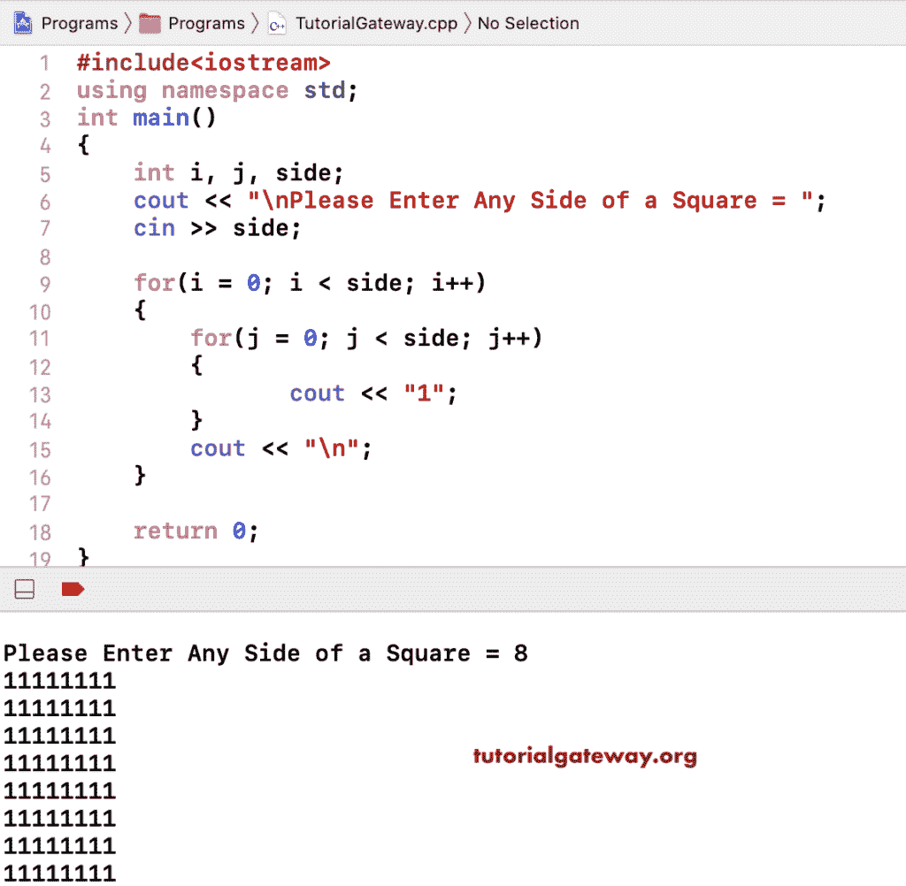

# C++ 程序：打印数字的方形图案

> 原文：<https://www.tutorialgateway.org/cpp-program-to-print-square-number-pattern/>

用一个例子编写 C++ 程序打印数字的正方形图案。在这个 C++ 例子中，我们使用嵌套 for 循环以正方形图案打印 1。

```cpp
#include<iostream>
using namespace std;

int main()
{
	int i, j, side;

    cout << "\nPlease Enter Any Side of a Square = ";
    cin >> side;

    for(i = 0; i < side; i++)
    {
    	for(j = 0; j < side; j++)
		{
           	cout << "1";
        }
        cout << "\n";
    }

 	return 0;
}
```



## 打印 0 的正方形图案的 C++ 程序

```cpp
#include<iostream>
using namespace std;

int main()
{
	int i, j, side;

    cout << "\nPlease Enter Any Side of a Square = ";
    cin >> side;

    for(i = 0; i < side; i++)
    {
    	for(j = 0; j < side; j++)
		{
           	cout << "0";
        }
        cout << "\n";
    }

 	return 0;
}
```

```cpp
Please Enter Any Side of a Square = 10
0000000000
0000000000
0000000000
0000000000
0000000000
0000000000
0000000000
0000000000
0000000000
0000000000
```

使用 While 循环打印数字的方形图案的 C++ 程序

```cpp
#include<iostream>
using namespace std;

int main()
{
	int i, j, side;

    cout << "\nPlease Enter Any Side of a Square = ";
    cin >> side;

    i = 0;  
    while(i < side)
    {
    	j = 0;
    	while( j < side)
		{
           	cout << "1";
           	j++;
        }
        cout << "\n";
        i++;
    }

 	return 0;
}
```

```cpp
Please Enter Any Side of a Square = 7
1111111
1111111
1111111
1111111
1111111
1111111
1111111
```

这个 [C++](https://www.tutorialgateway.org/cpp-programs/) 方块数字图案示例允许用户输入任意数字，然后在方块中打印该数字。

```cpp
#include<iostream>
using namespace std;

int main()
{
	int number, i, j, side;

    cout << "\nPlease Enter Any Side of a Square = ";
    cin >> side;

	cout << "\nPlease Enter Any Integer Value to Print as a Square = ";
    cin >> number;

    for(i = 0; i < side; i++)
    {
    	for(j = 0; j < side; j++)
		{
           	cout << number;
        }
        cout << "\n";
    }

 	return 0;
}
```

```cpp
Please Enter Any Side of a Square = 8

Please Enter Any Integer Value to Print as a Square = 9
99999999
99999999
99999999
99999999
99999999
99999999
99999999
99999999
```