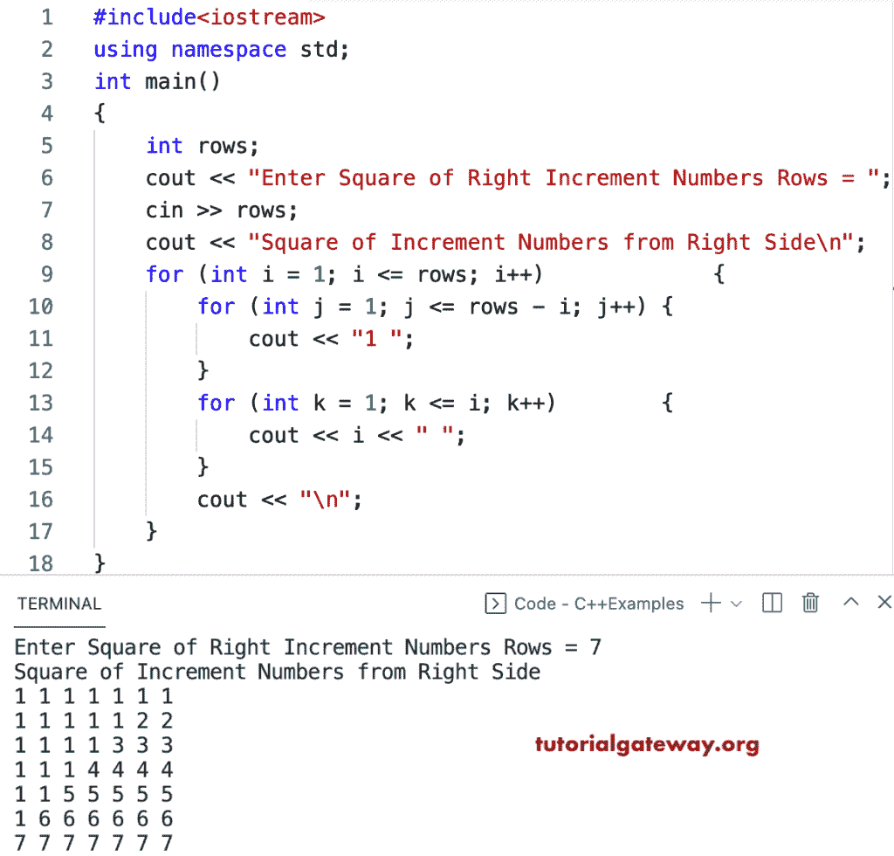

# C++ 程序：打印直角增量数字图案的正方形

> 原文：<https://www.tutorialgateway.org/cpp-program-to-print-square-of-right-increment-numbers-pattern/>

写一个 C++ 程序来打印用于循环的右递增数字模式的平方。

```cpp
#include<iostream>
using namespace std;

int main()
{
	int rows;

	cout << "Enter Square of Right Increment Numbers Rows = ";
	cin >> rows;

	cout << "Square of Increment Numbers from Right Side\n";

	for (int i = 1; i <= rows; i++)
	{
		for (int j = 1; j <= rows - i; j++)
		{
			cout << "1 ";
		}
		for (int k = 1; k <= i; k++)
		{
			cout << i << " ";
		}
		cout << "\n";
	}
}
```



这个 C++ 程序使用 while 循环从右侧显示增量数字的正方形模式。

```cpp
#include<iostream>
using namespace std;

int main()
{
	int rows, i, j, k;

	cout << "Enter Square of Right Increment Numbers Rows = ";
	cin >> rows;

	cout << "Square of Increment Numbers from Right Side\n";
	i = 1;

	while (i <= rows)
	{
		j = 1;
		while (j <= rows - i)
		{
			cout << "1 ";
			j++;
		}

		k = 1;
		while (k <= i)
		{
			cout << i << " ";
			k++;
		}
		cout << "\n";
		i++;
	}
}
```

```cpp
Enter Square of Right Increment Numbers Rows = 8
Square of Increment Numbers from Right Side
1 1 1 1 1 1 1 1 
1 1 1 1 1 1 2 2 
1 1 1 1 1 3 3 3 
1 1 1 1 4 4 4 4 
1 1 1 5 5 5 5 5 
1 1 6 6 6 6 6 6 
1 7 7 7 7 7 7 7 
8 8 8 8 8 8 8 8 
```

在这个 [C++ 例子](https://www.tutorialgateway.org/cpp-programs/)中，squareIncNum 函数迭代并打印正方形模式，其中它的数字从右手边开始递增。

```cpp
#include<iostream>
using namespace std;

void squareIncNum(int rows)
{
	for (int i = 1; i <= rows; i++)
	{
		for (int j = 1; j <= rows - i; j++)
		{
			cout << "1 ";
		}
		for (int k = 1; k <= i; k++)
		{
			cout << i << " ";
		}
		cout << "\n";
	}
}

int main()
{
	int rows;

	cout << "Enter Square of Right Increment Numbers Rows = ";
	cin >> rows;

	cout << "Square of Increment Numbers from Right Side\n";
	squareIncNum(rows);
}
```

```cpp
Enter Square of Right Increment Numbers Rows = 9
Square of Increment Numbers from Right Side
1 1 1 1 1 1 1 1 1 
1 1 1 1 1 1 1 2 2 
1 1 1 1 1 1 3 3 3 
1 1 1 1 1 4 4 4 4 
1 1 1 1 5 5 5 5 5 
1 1 1 6 6 6 6 6 6 
1 1 7 7 7 7 7 7 7 
1 8 8 8 8 8 8 8 8 
9 9 9 9 9 9 9 9 9 
```