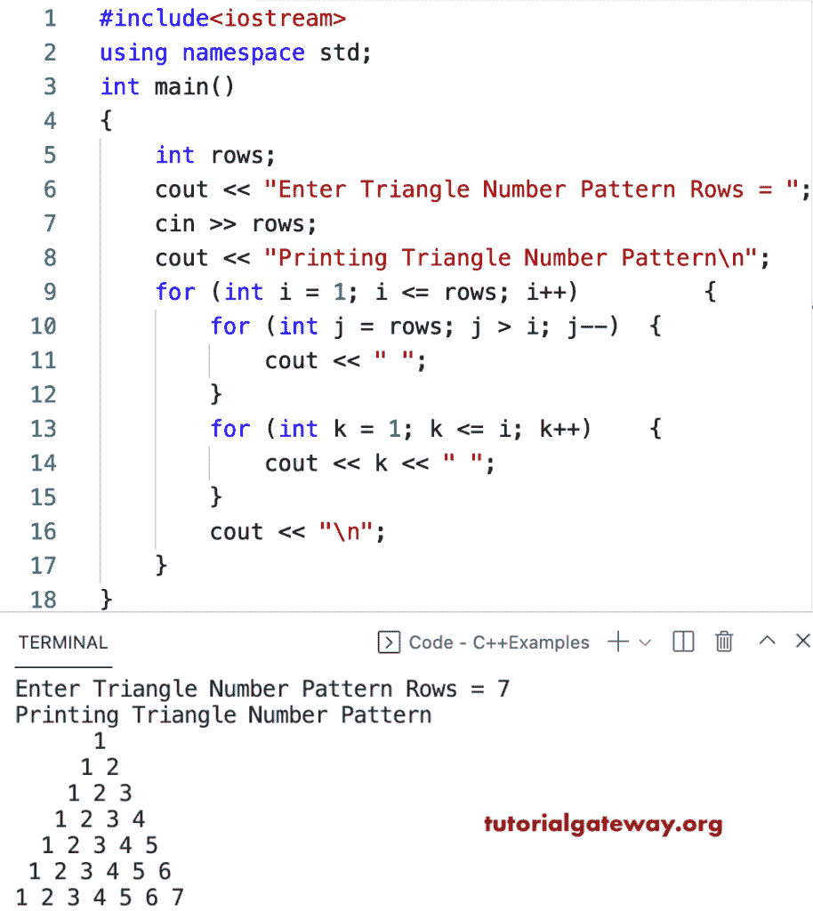

# C++ 程序：打印数字的三角形图案

> 原文：<https://www.tutorialgateway.org/cpp-program-to-print-triangle-numbers-pattern/>

写一个 C++ 程序来打印用于循环的三角形数字图案。

```cpp
#include<iostream>
using namespace std;

int main()
{
	int rows;

	cout << "Enter Triangle Number Pattern Rows = ";
	cin >> rows;

	cout << "Printing Triangle Number Pattern\n";

	for (int i = 1; i <= rows; i++)
	{
		for (int j = rows; j > i; j--)
		{
			cout << " ";
		}
		for (int k = 1; k <= i; k++)
		{
			cout << k << " ";
		}
		cout << "\n";
	}
}
```



使用 while 循环打印三角形数字图案的 C++ 程序。

```cpp
#include<iostream>
using namespace std;

int main()
{
	int rows, i, j, k;

	cout << "Enter Triangle Number Pattern Rows = ";
	cin >> rows;

	cout << "Printing Triangle Number Pattern\n";
	i = 1;

	while (i <= rows)
	{
		j = rows;
		while (j > i)
		{
			cout << " ";
			j--;
		}

		k = 1;
		while (k <= i)
		{
			cout << k << " ";
			k++;
		}
		cout << "\n";
		i++;
	}
}
```

```cpp
Enter Triangle Number Pattern Rows = 9
Printing Triangle Number Pattern
        1 
       1 2 
      1 2 3 
     1 2 3 4 
    1 2 3 4 5 
   1 2 3 4 5 6 
  1 2 3 4 5 6 7 
 1 2 3 4 5 6 7 8 
1 2 3 4 5 6 7 8 9 
```

这个 C++ 示例使用 do while 循环显示数字的三角形模式。

```cpp
#include<iostream>
using namespace std;

int main()
{
	int i, j, k, rows;

	cout << "Enter Triangle Number Pattern Rows = ";
	cin >> rows;

	cout << "Printing Triangle Number Pattern\n";
	i = 1;

	do
	{
		j = rows;
		do
		{
			cout << " ";

		} while (j-- > i);

		k = 1;
		do
		{
			cout << k << " ";

		} while (++k <= i);
		cout << "\n";

	} while (++i <= rows);
}
```

```cpp
Enter Triangle Number Pattern Rows = 12
Printing Triangle Number Pattern
            1 
           1 2 
          1 2 3 
         1 2 3 4 
        1 2 3 4 5 
       1 2 3 4 5 6 
      1 2 3 4 5 6 7 
     1 2 3 4 5 6 7 8 
    1 2 3 4 5 6 7 8 9 
   1 2 3 4 5 6 7 8 9 10 
  1 2 3 4 5 6 7 8 9 10 11 
 1 2 3 4 5 6 7 8 9 10 11 12 
```