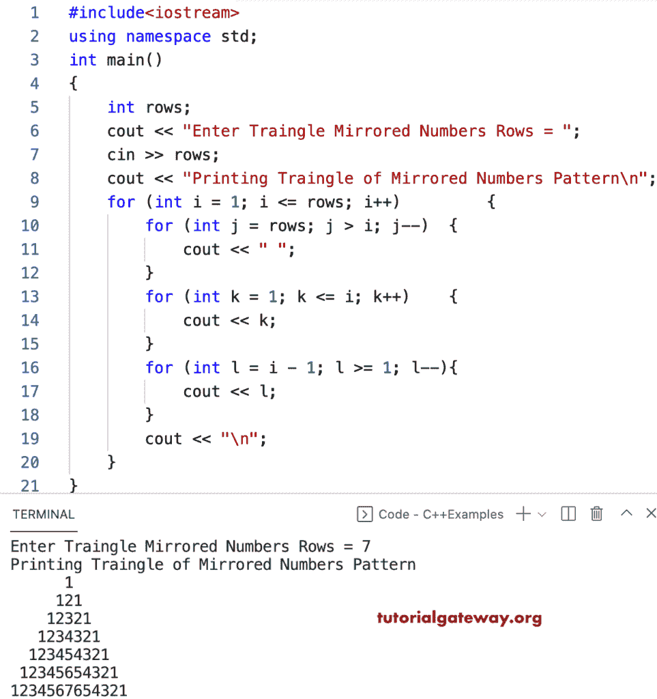

# C++ 程序：打印镜像数字的三角形图案

> 原文：<https://www.tutorialgateway.org/cpp-program-to-print-triangle-of-mirrored-numbers-pattern/>

写一个 C++ 程序来打印用于循环的镜像数字三角形图案。

```cpp
#include<iostream>
using namespace std;

int main()
{
	int rows;

	cout << "Enter Traingle Mirrored Numbers Rows = ";
	cin >> rows;

	cout << "Printing Traingle of Mirrored Numbers Pattern\n";

	for (int i = 1; i <= rows; i++)
	{
		for (int j = rows; j > i; j--)
		{
			cout << " ";
		}
		for (int k = 1; k <= i; k++)
		{
			cout << k;
		}
		for (int l = i - 1; l >= 1; l--)
		{
			cout << l;
		}
		cout << "\n";
	}
}
```



这个 [C++ 模式](https://www.tutorialgateway.org/cpp-programs/)示例使用 while 循环打印镜像数字的三角形图案。

```cpp
#include<iostream>
using namespace std;

int main()
{
	int rows, i, j, k, l;

	cout << "Enter Traingle Mirrored Numbers Rows = ";
	cin >> rows;

	cout << "Printing Traingle of Mirrored Numbers Pattern\n";
	i = 1;

	while (i <= rows)
	{
		j = rows;
		while (j > i)
		{
			cout << " ";
			j--;
		}

		k = 1;
		while (k <= i)
		{
			cout << k;
			k++;
		}

		l = i - 1;
		while (l >= 1)
		{
			cout << l;
			l--;
		}

		cout << "\n";
		i++;
	}
}
```

```cpp
Enter Traingle Mirrored Numbers Rows = 9
Printing Traingle of Mirrored Numbers Pattern
        1
       121
      12321
     1234321
    123454321
   12345654321
  1234567654321
 123456787654321
12345678987654321
```