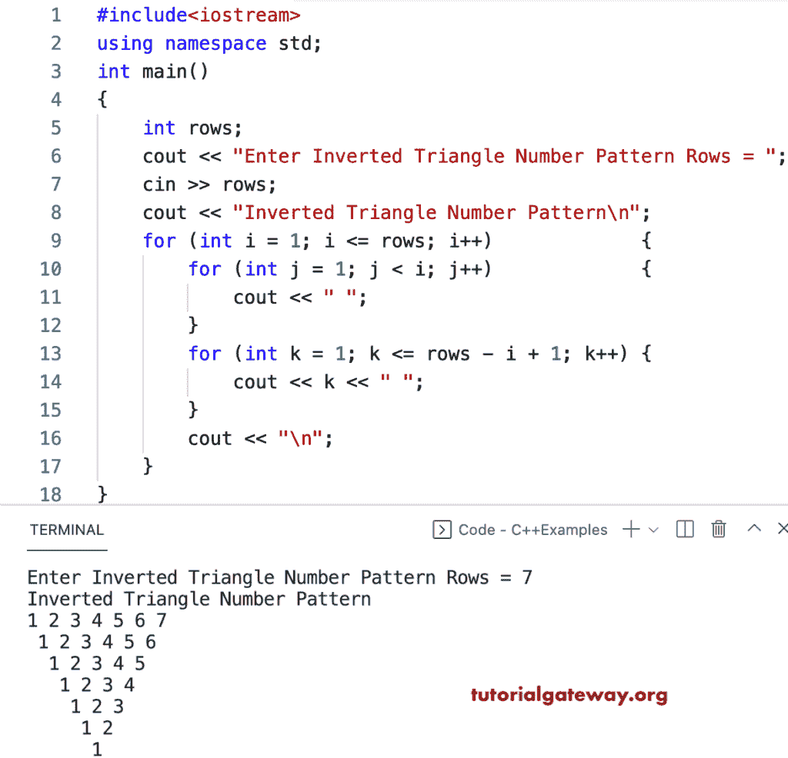

# C++ 程序：打印数字的倒三角图案

> 原文：<https://www.tutorialgateway.org/cpp-program-to-print-inverted-triangle-numbers-pattern/>

写一个 C++ 程序来打印用于循环的倒三角数字图案。

```cpp
#include<iostream>
using namespace std;

int main()
{
	int rows;

	cout << "Enter Inverted Triangle Number Pattern Rows = ";
	cin >> rows;

	cout << "Inverted Triangle Number Pattern\n";

	for (int i = 1; i <= rows; i++)
	{
		for (int j = 1; j < i; j++)
		{
			cout << " ";
		}
		for (int k = 1; k <= rows - i + 1; k++)
		{
			cout << k << " ";
		}
		cout << "\n";
	}
}
```



C++ 程序打印倒三角数字图案使用 while 循环。

```cpp
#include<iostream>
using namespace std;

int main()
{
	int rows, i, j, k;

	cout << "Enter Inverted Triangle Number Pattern Rows = ";
	cin >> rows;

	cout << "Inverted Triangle Number Pattern\n";
	i = 1;

	while (i <= rows)
	{
		j = 1;
		while (j < i)
		{
			cout << " ";
			j++;
		}

		k = 1;
		while (k <= rows - i + 1)
		{
			cout << k << " ";
			k++;
		}
		cout << "\n";
		i++;
	}
}
```

```cpp
Enter Inverted Triangle Number Pattern Rows = 9
Inverted Triangle Number Pattern
1 2 3 4 5 6 7 8 9 
 1 2 3 4 5 6 7 8 
  1 2 3 4 5 6 7 
   1 2 3 4 5 6 
    1 2 3 4 5 
     1 2 3 4 
      1 2 3 
       1 2 
        1 
```

这个 [C++ 例子](https://www.tutorialgateway.org/cpp-programs/)使用 do while 循环显示数字的倒三角模式。

```cpp
#include<iostream>
using namespace std;

int main()
{
	int rows, i, j, k;

	cout << "Enter Inverted Triangle Number Pattern Rows = ";
	cin >> rows;

	cout << "Inverted Triangle Number Pattern\n";
	i = 1;

	do
	{
		j = 1;
		do
		{
			cout << " ";

		} while (j++ < i);

		k = 1;
		do
		{
			cout << k << " ";

		} while (++k <= rows - i + 1);

		cout << "\n";

	} while (++i <= rows);
}
```

```cpp
Enter Inverted Triangle Number Pattern Rows = 6
Inverted Triangle Number Pattern
 1 2 3 4 5 6 
  1 2 3 4 5 
   1 2 3 4 
    1 2 3 
     1 2 
      1 
```