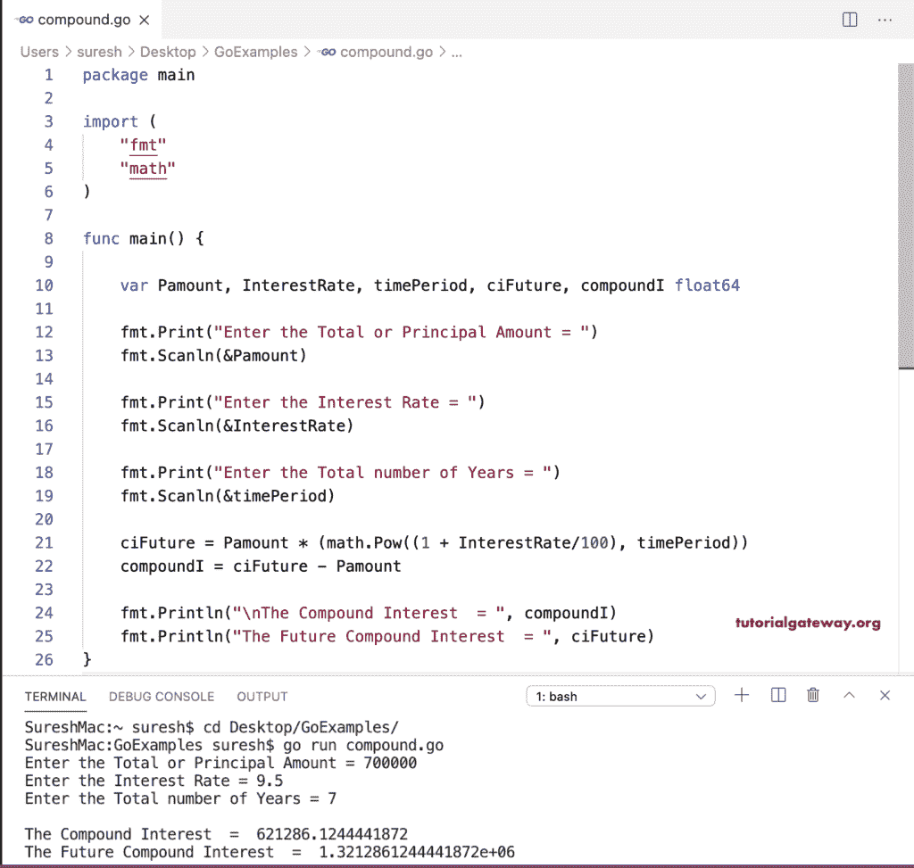

# Go 程序：计算复利

> 原文：<https://www.tutorialgateway.org/go-program-to-calculate-compound-interest/>

写一个 Go 程序来计算复利。这个 golang 程序允许用户输入本金、总年数和利率，然后找到复利。

*   未来复利=本金金额* (1 +利率)<sup>年</sup>
*   复利=未来复利-本金

```go
package main

import (
    "fmt"
    "math"
)

func main() {

    var Pamount, InterestRate, timePeriod, ciFuture, compoundI float64

    fmt.Print("Enter the Total or Principal Amount = ")
    fmt.Scanln(&Pamount)

    fmt.Print("Enter the Interest Rate = ")
    fmt.Scanln(&InterestRate)

    fmt.Print("Enter the Total number of Years = ")
    fmt.Scanln(&timePeriod)

    ciFuture = Pamount * (math.Pow((1 + InterestRate/100), timePeriod))
    compoundI = ciFuture - Pamount

    fmt.Println("\nThe Compound Interest  = ", compoundI)
    fmt.Println("The Future Compound Interest  = ", ciFuture)
}
```

