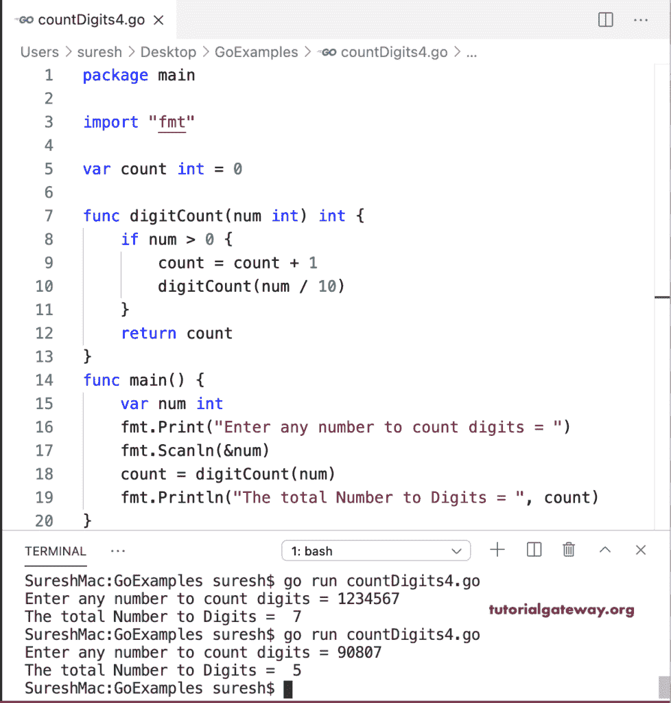

# Go 程序：计数数字

> 原文：<https://www.tutorialgateway.org/go-program-to-count-digits-in-a-number/>

编写一个 Go 程序来计算用于循环的数字中的位数。for 循环条件(num > 0)确保该数字大于零。在循环中，我们增加计数值。接下来，我们将数字除以十(num = num / 10)，这将删除数字的最后一位。

```go
package main

import "fmt"

func main() {

    var num, count int
    count = 0

    fmt.Print("Enter any number to count digits = ")
    fmt.Scanln(&num)

    for num > 0 {
        num = num / 10
        count = count + 1
    }
    fmt.Println("The total Number to Digits = ", count)
}
```

```go
SureshMac:GoExamples suresh$ go run countDigits1.go
Enter any number to count digits = 46782
The total Number to Digits =  5
SureshMac:GoExamples suresh$ go run countDigits1.go
Enter any number to count digits = 657
The total Number to Digits =  3
SureshMac:GoExamples suresh$ 
```

## 数数的 Golang 程序

在这个 Golang 示例中，我们更改了 for 循环，并计算了用户给定值中各个数字的总数。

```go
package main

import "fmt"

func main() {

    var num, count int

    fmt.Print("Enter any number to count digits = ")
    fmt.Scanln(&num)

    for count = 0; num > 0; num = num / 10 {
        count = count + 1
    }
    fmt.Println("The total Number to Digits = ", count)
}
```

```go
SureshMac:GoExamples suresh$ go run countDigits2.go
Enter any number to count digits = 560986
The total Number to Digits =  6
SureshMac:GoExamples suresh$ go run countDigits2.go
Enter any number to count digits = 23
The total Number to Digits =  2
SureshMac:GoExamples suresh$ 
```

使用函数计算数字中的位数

```go
package main

import "fmt"

func digitCount(num int) int {
    var count int = 0
    for num > 0 {
        num = num / 10
        count = count + 1
    }
    return count
}

func main() {

    var num, count int

    fmt.Print("Enter any number to count digits = ")
    fmt.Scanln(&num)

    count = digitCount(num)
    fmt.Println("The total Number to Digits = ", count)
}
```

```go
SureshMac:GoExamples suresh$ go run countDigits3.go
Enter any number to count digits = 2345
The total Number to Digits =  4
SureshMac:GoExamples suresh$ go run countDigits3.go
Enter any number to count digits = 987
The total Number to Digits =  3
SureshMac:GoExamples suresh$ 
```

在这个 Go [程序](https://www.tutorialgateway.org/go-programs/)中返回一个数字中的数字，我们用更新的值递归调用 digitCount(num / 10)函数。

```go
package main

import "fmt"

var count int = 0

func digitCount(num int) int {
    if num > 0 {
        count = count + 1
        digitCount(num / 10)
    }
    return count
}

func main() {

    var num int

    fmt.Print("Enter any number to count digits = ")
    fmt.Scanln(&num)

    count = digitCount(num)
    fmt.Println("The total Number to Digits = ", count)
}
```

