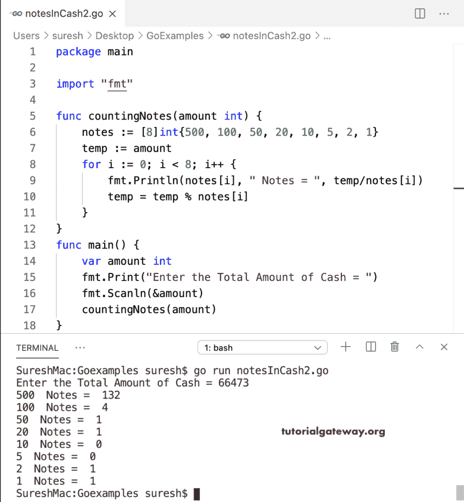

# Go 程序：计算给定总额的纸币总数

> 原文：<https://www.tutorialgateway.org/go-program-to-count-total-notes-in-an-amount/>

编写一个 Go 程序，使用数组和 For 循环来计算给定数量的纸币总数。首先，我们声明了一个包含可用注释的整数数组。接下来，我们使用 for 循环(对于 I:= 0；I < 8；i++)来迭代 notes 数组，并用每个数组项来划分数量。然后，我们通过从原始数据中删除该现金金额来更新计数。

```go
package main

import "fmt"

func main() {
    notes := [8]int{500, 100, 50, 20, 10, 5, 2, 1}
    var amount int
    fmt.Print("Enter the Total Amount of Cash = ")
    fmt.Scanln(&amount)

    temp := amount
    for i := 0; i < 8; i++ {
        fmt.Println(notes[i], " Notes = ", temp/notes[i])
        temp = temp % notes[i]
    }
}
```

```go
Enter the Total Amount of Cash = 5698
500  Notes =  11
100  Notes =  1
50  Notes =  1
20  Notes =  2
10  Notes =  0
5  Notes =  1
2  Notes =  1
1  Notes =  1
```

## Go 程序：使用函数计算票据总额

在这个 Golang 程序中，我们创建了一个(countingNotes(amount int))函数，该函数计算并打印给定现金中的纸币。

```go
package main

import "fmt"

func countingNotes(amount int) {
    notes := [8]int{500, 100, 50, 20, 10, 5, 2, 1}
    temp := amount

    for i := 0; i < 8; i++ {
        fmt.Println(notes[i], " Notes = ", temp/notes[i])
        temp = temp % notes[i]
    }
}
func main() {

    var amount int
    fmt.Print("Enter the Total Amount of Cash = ")
    fmt.Scanln(&amount)
    countingNotes(amount)

}
```

