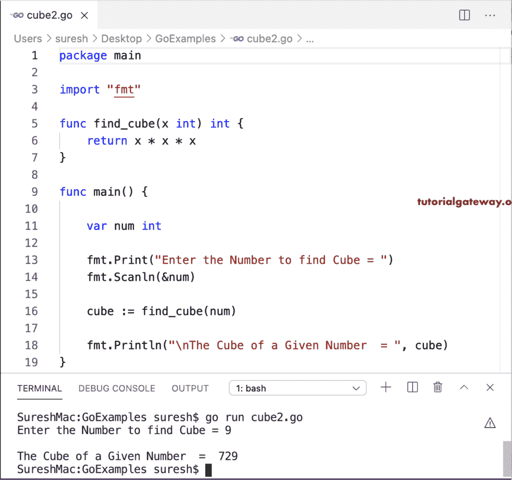

# Go 程序：计算数字立方

> 原文：<https://www.tutorialgateway.org/go-program-to-calculate-cube-of-a-number/>

这个 go 程序计算一个数的立方，我们用算术运算符(乘法)来求立方。

```go
package main

import "fmt"

func main() {

    var num int

    fmt.Print("Enter the Number to find Cube = ")
    fmt.Scanln(&num)

    cube := num * num * num

    fmt.Println("\nThe Cube of a Given Number  = ", cube)
}
```

```go
Enter the Number to find Cube = 7

The Cube of a Given Number  =  343
```

在这个 Golang 程序中，我们声明了一个接受整数并返回数字立方的函数。接下来，在主[程序](https://www.tutorialgateway.org/go-programs/)中，我们调用 find_cube 函数。

```go
package main

import "fmt"

func find_cube(x int) int {
    return x * x * x
}

func main() {

    var num int

    fmt.Print("Enter the Number to find Cube = ")
    fmt.Scanln(&num)

    cube := find_cube(num)

    fmt.Println("\nThe Cube of a Given Number  = ", cube)
}
```

