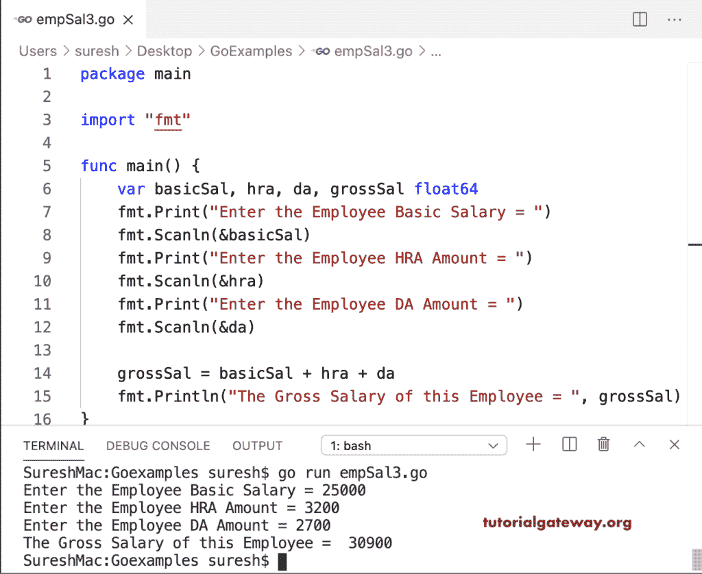

# Go 程序：以计算员工薪资

> 原文：<https://www.tutorialgateway.org/go-program-to-calculate-employee-salary/>

该 Go 程序使用 Else If 语句来计算员工的总薪资。请根据需要替换人力资源分析和数据分析百分比。

```go
package main

import "fmt"

func main() {

    var basicSal, hra, da, grossSal float64

    fmt.Print("Enter the Employee Basic Salary = ")
    fmt.Scanln(&basicSal)

    if basicSal <= 10000 {
        hra = (basicSal * 8) / 100
        da = (basicSal * 10) / 100
    } else if basicSal <= 20000 {
        hra = (basicSal * 16) / 100
        da = (basicSal * 20) / 100
    } else {
        hra = (basicSal * 24) / 100
        da = (basicSal * 30) / 100
    }

    grossSal = basicSal + hra + da
    fmt.Println("The Gross Salary of this Employee = ", grossSal)
}
```

```go
SureshMac:Goexamples suresh$ go run empSal1.go
Enter the Employee Basic Salary = 8000
The Gross Salary of this Employee =  9440
SureshMac:Goexamples suresh$ go run empSal1.go
Enter the Employee Basic Salary = 18000
The Gross Salary of this Employee =  24480
SureshMac:Goexamples suresh$ go run empSal1.go
Enter the Employee Basic Salary = 35000
The Gross Salary of this Employee =  53900
SureshMac:Goexamples suresh$ 
```

## 计算员工工资的 Golang 程序

这个 Go 示例允许用户输入基本工资、人力资源和地区分配百分比来查找总工资。

```go
package main

import "fmt"

func main() {

    var basicSal, hra, hraPer, da, daPer, grossSal float64

    fmt.Print("Enter the Employee Basic Salary = ")
    fmt.Scanln(&basicSal)

    fmt.Print("Enter the Employee HRA Percentage = ")
    fmt.Scanln(&hraPer)

    fmt.Print("Enter the Employee DA Percentage = ")
    fmt.Scanln(&daPer)

    hra = basicSal * (hraPer / 100)
    da = basicSal * (daPer / 100)
    grossSal = basicSal + hra + da
    fmt.Println("The HRA of this Employee = ", hra)
    fmt.Println("The DA of this Employee = ", da)
    fmt.Println("The Gross Salary of this Employee = ", grossSal)
}
```

```go
SureshMac:Goexamples suresh$ go run empSal2.go
Enter the Employee Basic Salary = 35000
Enter the Employee HRA Percentage = 25
Enter the Employee DA Percentage = 35
The HRA of this Employee =  8750
The DA of this Employee =  12250
The Gross Salary of this Employee =  56000
```

在这个 Go 程序中，我们允许用户输入固定的 DA，HRA 的金额就是工资总额。

```go
package main

import "fmt"

func main() {

    var basicSal, hra, da, grossSal float64

    fmt.Print("Enter the Employee Basic Salary = ")
    fmt.Scanln(&basicSal)

    fmt.Print("Enter the Employee HRA Amount = ")
    fmt.Scanln(&hra)

    fmt.Print("Enter the Employee DA Amount = ")
    fmt.Scanln(&da)

    grossSal = basicSal + hra + da
    fmt.Println("The Gross Salary of this Employee = ", grossSal)
}
```

