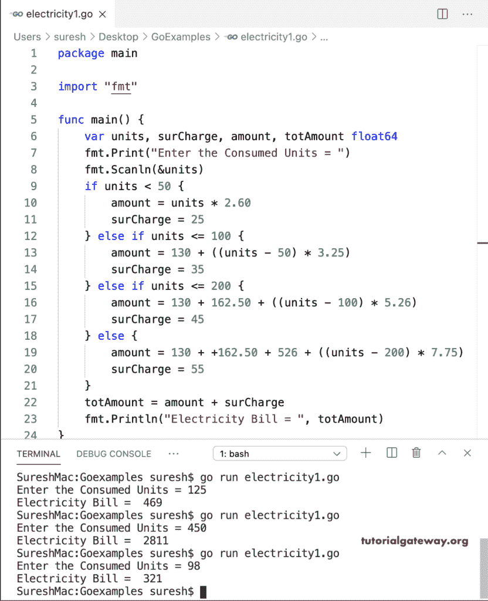

# Go 程序：计算电费

> 原文：<https://www.tutorialgateway.org/go-program-to-calculate-electricity-bill/>

在这个计算电费的 Go 程序中，我们假设您的电力局根据单位的消耗收取不同的电费。对于这个 Go 示例，我们使用了 Else If 语句，

*   否则，如果单位< = 100–前五十个单位的费用为 130 (2.60 * 50)。所以，我们把这个数字加起来，从总数中去掉这 50 个单位。
*   否则，如果单位< = 200–前 50 个单位的费用是 130，50 到 100 个单位的变化是 162.50 (3.25 * 50)。所以，我们把这个数加起来，从总数中去掉这 100 个单位。
*   否则–前五十个单位的费用是 130，50 到 100 是 162.50，100 到 200 是 526 (5.65 * 100)。所以，我们追加了这个数量，并从总数中排除了这 200 个单位。

```go
package main

import "fmt"

func main() {

    var units, surCharge, amount, totAmount float64

    fmt.Print("Enter the Consumed Units = ")
    fmt.Scanln(&units)

    if units < 50 {
        amount = units * 2.60
        surCharge = 25
    } else if units <= 100 {
        amount = 130 + ((units - 50) * 3.25)
        surCharge = 35
    } else if units <= 100 {
        amount = 130 + 162.50 + ((units - 100) * 5.26)
        surCharge = 45
    } else {
        amount = 130 + +162.50 + 526 + ((units - 200) * 7.75)
        surCharge = 55
    }
    totAmount = amount + surCharge
    fmt.Println("Electricity Bill = ", totAmount)
}
```



## 计算电费的 Golang 程序

在这个 Go 示例中，我们假设您对设备采用统一费率或固定费率，并计算电费。

```go
package main

import "fmt"

func main() {

    var units, surCharge, amount, totAmount float64

    fmt.Print("Enter the Consumed Units = ")
    fmt.Scanln(&units)

    if units > 500 {
        amount = units * 12.65
        surCharge = 125
    } else if units >= 300 {
        amount = units * 10.75
        surCharge = 100
    } else if units >= 200 {
        amount = units * 8.26
        surCharge = 85
    } else if units >= 100 {
        amount = units * 5.98
        surCharge = 65
    } else {
        amount = units * 3.85
        surCharge = 45
    }
    totAmount = amount + surCharge
    fmt.Println("Electricity Bill = ", totAmount)
}
```

```go
SureshMac:Goexamples suresh$ go run electricity2.go
Enter the Consumed Units = 720
Electricity Bill =  9233
SureshMac:Goexamples suresh$ go run electricity2.go
Enter the Consumed Units = 400
Electricity Bill =  4400
SureshMac:Goexamples suresh$ go electricity2.go
Enter the Consumed Units = 65
Electricity Bill =  295.25
```