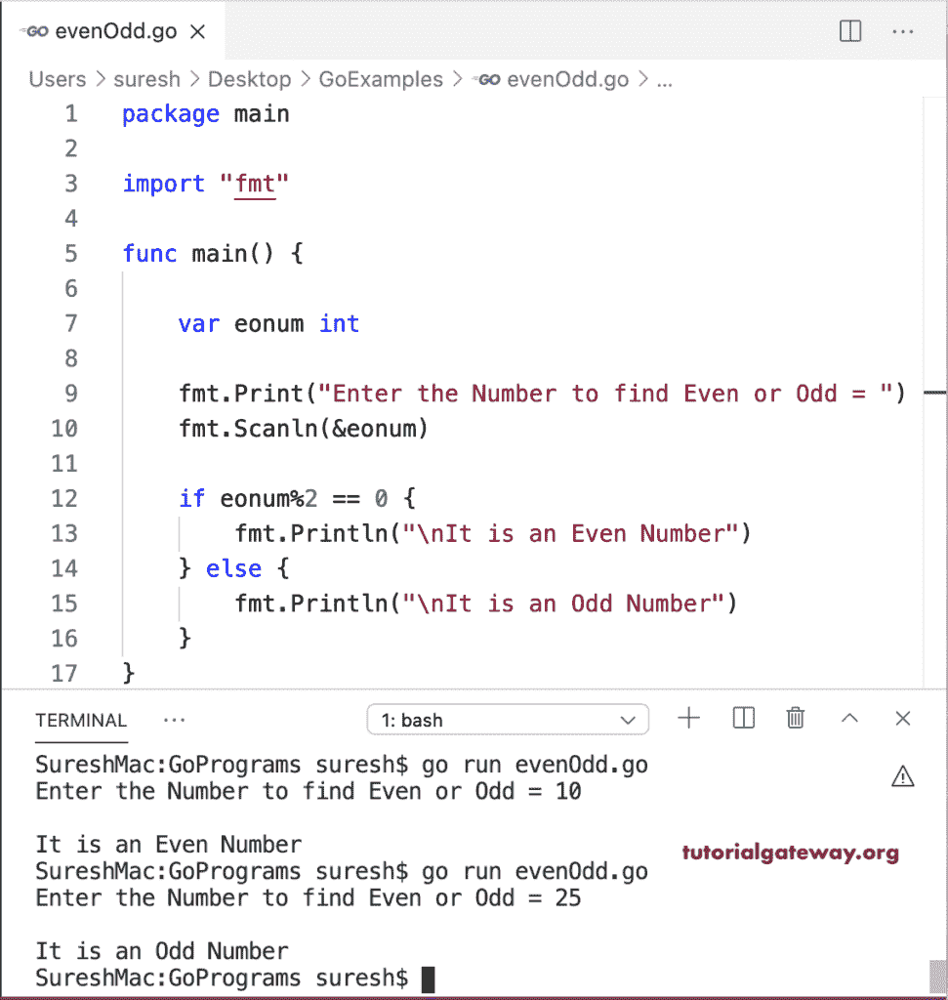

# Go 程序：检查偶数或奇数

> 原文：<https://www.tutorialgateway.org/go-program-to-check-even-or-odd/>

任何能被 2 整除的数都是偶数，剩下的都是奇数。这个 Go 程序使用 If else 来检查给定的数字是偶数还是奇数。在 If 条件(num % 2 == 0)中，我们使用模数(%)来检查 num 除以 2 的余数是否等于 0。如果为真，则为偶数，否则为奇数。

```go
package main

import "fmt"

func main() {

    var eonum int

    fmt.Print("Enter the Number to find Even or Odd = ")
    fmt.Scanln(&eonum)

    if eonum%2 == 0 {
        fmt.Println("\nIt is an Even Number")
    } else {
        fmt.Println("\nIt is an Odd Number")
    }
}
```

