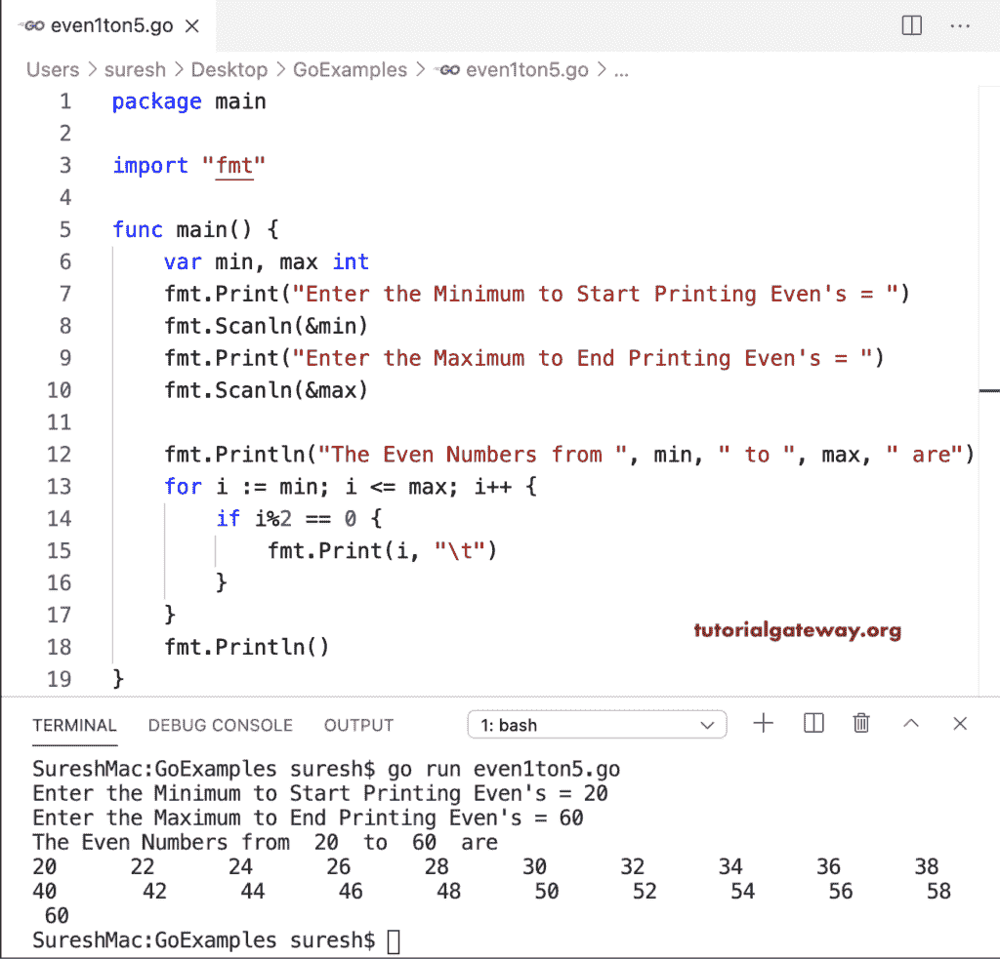

# Go 程序：打印偶数

> 原文：<https://www.tutorialgateway.org/go-program-to-print-even-numbers/>

这个打印从 1 到 n 的偶数的 Go 程序使用从 1 开始到偶数结束的 for 循环。在其中，if 语句检查可被 2 整除的数字的余数是否等于零。如果为真，则输出该偶数。

```go
package main

import "fmt"

func main() {

    var evnum int

    fmt.Print("Enter the Number to Print Even's = ")
    fmt.Scanln(&evnum)

    fmt.Println("Even Numbers from 1 to ", evnum, " are = ")
    for i := 1; i <= evnum; i++ {
        if i%2 == 0 {
            fmt.Print(i, "\t")
        }
    }
    fmt.Println()
}
```

```go
Enter the Number to Print Even's = 10
Even Numbers from 1 to  10  are = 
2       4       6       8       10
```

## Golang 程序打印从 1 到 N 的偶数

在这个 Golang 程序中，for 循环从 2 开始，以 2 为增量。因为我们跳过了奇数，所以所有的数字都是偶数。

```go
package main

import "fmt"

func main() {

    var evnum, i int

    fmt.Print("Enter the Number to Print Even's = ")
    fmt.Scanln(&evnum)

    fmt.Println("Even Numbers from 1 to ", evnum, " are = ")
    for i = 2; i <= evnum; i = i + 2 {
        fmt.Print(i, "\t")
    }
    fmt.Println()
}
```

```go
Enter the Number to Print Even's = 20
Even Numbers from 1 to  20  are = 
2       4       6       8       10      12      14      16      18      20
```

这是循环显示偶数的另一种书写方式。

```go
package main

import "fmt"

func main() {

    var evnum int

    fmt.Print("Enter the Number to Print Even's = ")
    fmt.Scanln(&evnum)

    i := 2
    fmt.Println("Even Numbers from 1 to ", evnum, " are = ")
    for i <= evnum {
        fmt.Print(i, "\t")
        i = i + 2
    }
    fmt.Println()
}
```

```go
Enter the Number to Print Even's = 30
Even Numbers from 1 to  30  are = 
2       4       6       8       10      12      14      16      18      20      22 24      26      28      30
```

这个 Go 程序从最小到最大返回偶数。第一个 if 语句检查最小值是否为奇数，如果为真，则最小值递增 1。所以它变成了一个偶数。我们在 for 循环中将这个值增加了 2，这样所有的数字都是偶数。每个数字都不需要额外的 if 语句。

```go
package main

import "fmt"

func main() {

    var min, max int

    fmt.Print("Enter the Minimum to Start Printing Even's = ")
    fmt.Scanln(&min)
    fmt.Print("Enter the Maximum to End Printing Even's = ")
    fmt.Scanln(&max)

    if min%2 != 0 {
        min++
    }
    fmt.Print("The Even Numbers from ", min, " to ", max, " are \n")
    for i := min; i <= max; i = i + 2 {
        fmt.Print(i, "\t")
    }
    fmt.Println()
}
```

```go
Enter the Minimum to Start Printing Even's = 10
Enter the Maximum to End Printing Even's = 40
The Even Numbers from 10 to 40 are 
10      12      14      16      18      20      22      24      26      28      30 32      34      36      38      40
```

转到程序使用函数打印偶数。这个 Golang 示例与第一个偶数[示例](https://www.tutorialgateway.org/go-programs/)相同。但是，它会打印最小和最大限值中的偶数。

```go
package main

import "fmt"

func main() {

    var min, max int

    fmt.Print("Enter the Minimum to Start Printing Even's = ")
    fmt.Scanln(&min)
    fmt.Print("Enter the Maximum to End Printing Even's = ")
    fmt.Scanln(&max)

    fmt.Print("The Even Numbers from ", min, " to ", max, " are \n")
    for i := min; i <= max; i++ {
        if i%2 == 0 {
            fmt.Print(i, "\t")
        }
    }
}
```

