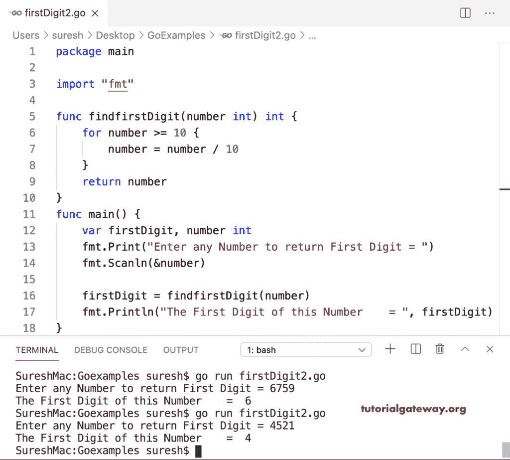

# Go 程序：查找数字的第一个数字

> 原文：<https://www.tutorialgateway.org/go-program-to-find-first-digit-of-a-number/>

写一个 Go 程序，用 For 循环找出一个数字的第一位。循环条件(第一个数字> = 10)返回真，直到数字大于或等于 10。我们将数字除以 10 (firstDigit = firstDigit / 10)，这将在所有迭代后返回第一个值。

```go
package main

import "fmt"

func main() {

    var firstDigit, number int

    fmt.Print("Enter any Number to return First Digit = ")
    fmt.Scanln(&number)

    firstDigit = number
    for firstDigit >= 10 {
        firstDigit = firstDigit / 10
    }

    fmt.Println("The First Digit of this Number    = ", firstDigit)
}
```

```go
SureshMac:Goexamples suresh$ go run firstDigit1.go
Enter any Number to return First Digit = 3478
The First Digit of this Number    =  3
SureshMac:Goexamples suresh$ go run firstDigit1.go
Enter any Number to return First Digit = 9876
The First Digit of this Number    =  9
```

## 使用函数查找数字第一位的程序

在这个 Golang 程序中，我们创建了一个(func findfirstDigit(number int))函数，返回给定数字的第一个数字。接下来，我们从 main 调用这个函数。

```go
package main

import "fmt"

func findfirstDigit(number int) int {
    for number >= 10 {
        number = number / 10
    }
    return number
}
func main() {

    var firstDigit, number int

    fmt.Print("Enter any Number to return First Digit = ")
    fmt.Scanln(&number)

    firstDigit = findfirstDigit(number)

    fmt.Println("The First Digit of this Number    = ", firstDigit)
}
```

