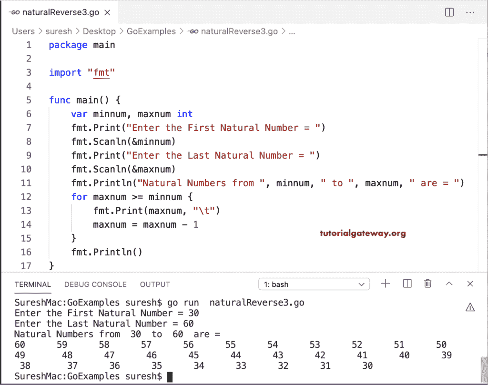

# Go 程序：逆序自然数

> 原文：<https://www.tutorialgateway.org/go-program-for-reverse-natural-numbers/>

这个逆序打印自然数的 Go 程序使用 for 循环开始从 n 到 1 的遍历。在循环中，println 语句打印自然数。

```go
package main

import "fmt"

func main() {

    var num, i int

    fmt.Print("\nEnter the Last Natural Number = ")
    fmt.Scanln(&num)

    fmt.Println("\nNatural Numbers from ", num, " to 1 are = ")
    for i = num; i >= 1; i = i - 1 {
        fmt.Print(i, "\t")
    }
    fmt.Println()
}
```

```go
Enter the Last Natural Number = 10

Natural Numbers from  10  to 1 are = 
10      9       8       7       6       5       4       3       2       1
```

## 反向打印自然数的程序

在这个 Golang [程序](https://www.tutorialgateway.org/go-programs/)中，我们改变 for 循环。

```go
package main

import "fmt"

func main() {

    var num int

    fmt.Print("\nEnter the Last Natural Number = ")
    fmt.Scanln(&num)

    fmt.Println("\nNatural Numbers from ", num, " to 1 are = ")
    for num >= 1 {
        fmt.Print(num, "\t")
        num = num - 1
    }
    fmt.Println()
}
```

```go
Enter the Last Natural Number = 20

Natural Numbers from  20  to 1 are = 
20      19      18      17      16      15      14      13      12      11      10    9       8       7       6       5       4       3       2       1
```

这个 Go 程序接受最小值和最大值，并打印从最大值到最小值的自然数。

```go
package main

import "fmt"

func main() {

    var minnum, maxnum int

    fmt.Print("\nEnter the First Natural Number = ")
    fmt.Scanln(&minnum)

    fmt.Print("\nEnter the Last Natural Number = ")
    fmt.Scanln(&maxnum)

    fmt.Println("\nNatural Numbers from ", minnum, " to ", maxnum, " are = ")
    for maxnum >= minnum {
        fmt.Print(maxnum, "\t")
        maxnum = maxnum - 1
    }
    fmt.Println()
}
```

