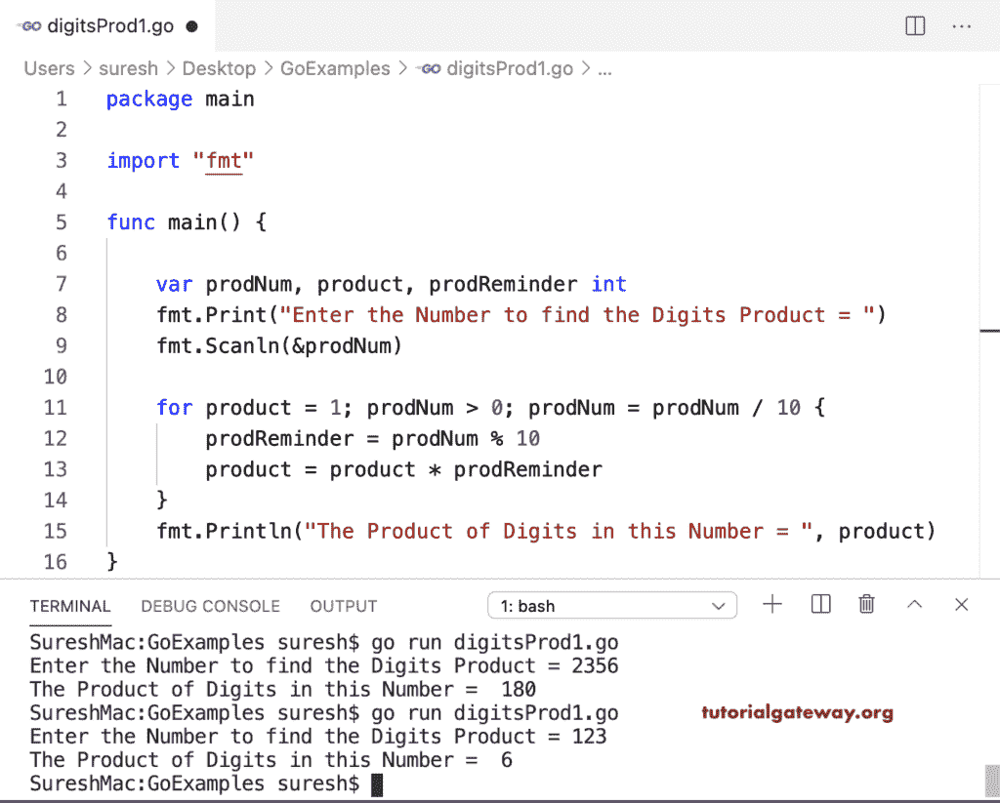

# Go 程序：计算数字的乘积

> 原文：<https://www.tutorialgateway.org/go-program-to-find-product-of-digits-in-a-number/>

编写一个查找循环中数字乘积的 Go 程序。for 循环条件保持数字大于零。在这个循环中，

*   from 提醒= prodNum % 10 ->返回数字的最后一位。
*   产品=产品*产品提醒->将最后一位乘以产品。
*   prodNum = prodNum/10–它从 prodNum 中删除最后一位。

```go
package main

import "fmt"

func main() {

    var prodNum, product, prodReminder int

    fmt.Print("Enter the Number to find the Digits Product = ")
    fmt.Scanln(&prodNum)

    for product = 1; prodNum > 0; prodNum = prodNum / 10 {
        prodReminder = prodNum % 10
        product = product * prodReminder
    }
    fmt.Println("The Product of Digits in this Number = ", product)
}
```



## Go 程序：使用函数查找数字的乘积

```go
package main

import "fmt"

var product int

func digitsProduct(prodNum int) int {
    var prodReminder int

    for product = 1; prodNum > 0; prodNum = prodNum / 10 {
        prodReminder = prodNum % 10
        product = product * prodReminder
    }
    return product
}
func main() {

    var prodNum int

    fmt.Print("Enter the Number to find the Digits Product = ")
    fmt.Scanln(&prodNum)

    product = digitsProduct(prodNum)
    fmt.Println("The Product of Digits in this Number = ", product)
}
```

```go
SureshMac:GoExamples suresh$ go run digitsProd2.go
Enter the Number to find the Digits Product = 879
The Product of Digits in this Number =  504
SureshMac:GoExamples suresh$ go run digitsProd2.go
Enter the Number to find the Digits Product = 45
The Product of Digits in this Number =  20
```

这个程序递归调用数字积函数来计算数字中的数字积。

```go
package main

import "fmt"

var product int = 1

func digitsProduct(prodNum int) int {
    if prodNum <= 0 {
        return 0
    }

    product = product * (prodNum % 10)
    digitsProduct(prodNum / 10)
    return product
}
func main() {
    var prodNum int

    fmt.Print("Enter the Number to find the Digits Product = ")
    fmt.Scanln(&prodNum)

    product = digitsProduct(prodNum)
    fmt.Println("The Product of Digits in this Number = ", product)
}
```

```go
SureshMac:GoExamples suresh$ go run digitsProd3.go
Enter the Number to find the Digits Product = 4789
The Product of Digits in this Number =  2016
SureshMac:GoExamples suresh$ go run digitsProd3.go
Enter the Number to find the Digits Product = 22457
The Product of Digits in this Number =  560
```