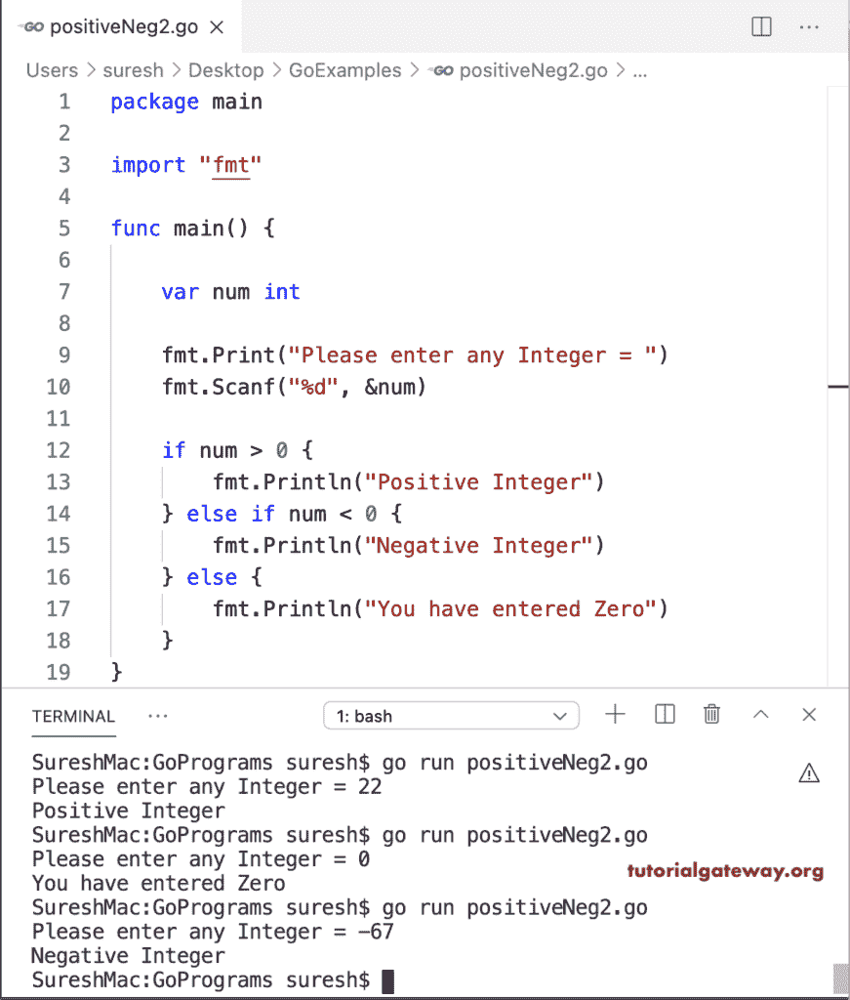

# Go 程序：检查正或负

> 原文：<https://www.tutorialgateway.org/go-program-to-check-positive-or-negative/>

任何大于零的数都是正数，如果小于零，则为负数。这个 Go 程序使用 If else 来检查给定的数字是正数还是负数。如果您看到“如果”条件，它会检查用户给定的数字是否大于零。

```go
package main

import "fmt"

func main() {

    var num int

    fmt.Print("Please enter any Integer = ")
    fmt.Scanf("%d", &num)

    if num >= 0 {
        fmt.Println("Positive Integer")
    } else {
        fmt.Println("Negative Integer")
    }
}
```

```go
SureshMac:GoExamples suresh$ go run positiveNeg1.go
Please enter any Integer = 10
Positive Integer
SureshMac:GoExamples suresh$ go run positiveNeg1.go
Please enter any Integer = -89
Negative Integer
SureshMac:GoExamples suresh$ go run positiveNeg1.go
Please enter any Integer = 0
Positive Integer
```

## 检查阳性或阴性的 Golang 程序

这个 Golang 程序使用嵌套 If 条件来检查零以及正数和负数。

```go
package main

import "fmt"

func main() {

    var num int

    fmt.Print("Please enter any Integer = ")
    fmt.Scanf("%d", &num)

    if num > 0 {
        fmt.Println("Positive Integer")
    } else if num < 0 {
        fmt.Println("Negative Integer")
    } else {
        fmt.Println("You have entered Zero")
    }
}
```



在这个 [Go 程序](https://www.tutorialgateway.org/go-programs/)中，我们使用嵌套 For 循环来检查数字是正、负还是零。

```go
package main

import "fmt"

func main() {

    var num int

    fmt.Print("Please enter any Integer = ")
    fmt.Scanf("%d", &num)

    if num >= 0 {
        if num > 0 {
            fmt.Println("Positive Integer")
        } else {
            fmt.Println("You have entered Zero")
        }

    } else {
        fmt.Println("Negative Integer")
    }
}
```

```go
SureshMac:GoExamples suresh$ go run positiveNeg3.go
Please enter any Integer = -55
Negative Integer
SureshMac:GoExamples suresh$ go run positiveNeg3.go
Please enter any Integer = 0
You have entered Zero
SureshMac:GoExamples suresh$ go run positiveNeg3.go
Please enter any Integer = 2
Positive Integer
```