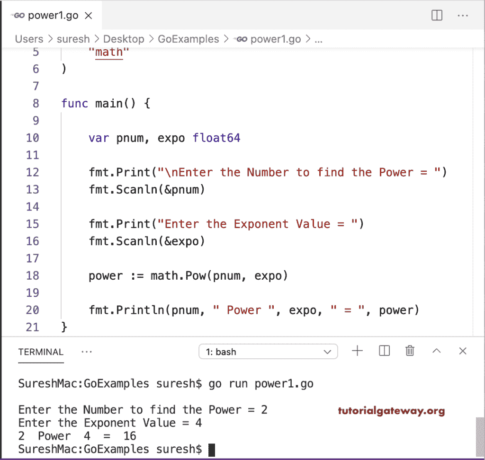

# Go 程序：寻找数字幂

> 原文：<https://www.tutorialgateway.org/go-program-to-find-power-of-a-number/>

这个 Go 程序使用数学幂函数来求一个数的幂。要使用这个函数，您必须导入数学模块。

```go
package main

import (
    "fmt"
    "math"
)

func main() {

    var pnum, expo float64

    fmt.Print("\nEnter the Number to find the Power = ")
    fmt.Scanln(&pnum)

    fmt.Print("Enter the Exponent Value = ")
    fmt.Scanln(&expo)

    power := math.Pow(pnum, expo)

    fmt.Println(pnum, " Power ", expo, " = ", power)
}
```



## 求数的幂的 Golang 程序

在这个 golang 程序中，for 循环将数字从 1 迭代到指数值。在此范围内，我们将给定的数相乘，并赋给幂。

```go
package main

import "fmt"

func main() {

    var i, pnum, expo, power int
    power = 1

    fmt.Print("\nEnter the Number to find the Power = ")
    fmt.Scanln(&pnum)

    fmt.Print("Enter the Exponent Value = ")
    fmt.Scanln(&expo)

    for i = 1; i <= expo; i++ {
        power = power * pnum
    }

    fmt.Println(pnum, " Power ", expo, " = ", power)
}
```

```go
SureshMac:GoExamples suresh$ go run power2.go

Enter the Number to find the Power = 10
Enter the Exponent Value = 2
10  Power  2  =  100
SureshMac:GoExamples suresh$ go run power2.go

Enter the Number to find the Power = 3
Enter the Exponent Value = 4
3  Power  4  =  81
```