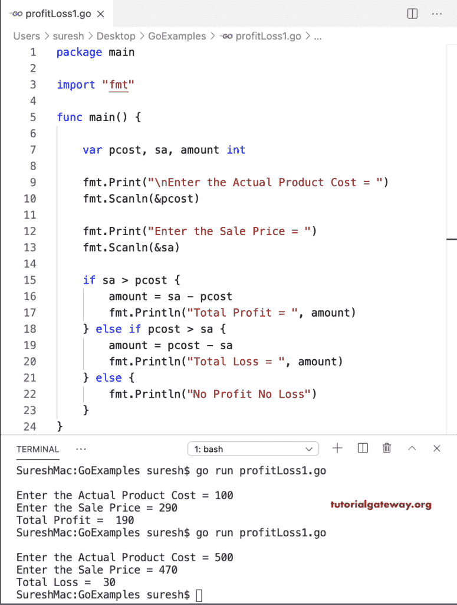

# Go 程序：计算利润或损失

> 原文：<https://www.tutorialgateway.org/go-program-to-calculate-profit-or-loss/>

这个 go 程序使用实际产品成本和销售金额来计算利润或损失。它使用 else if 语句来打印输出。

*   如果产品成本大于销售价格，那么就是亏损。
*   如果销售价格高于产品成本，那么产品就是利润——否则，没有利润或损失。

```go
package main

import "fmt"

func main() {

    var pcost, sa, amount int

    fmt.Print("\nEnter the Actual Product Cost = ")
    fmt.Scanln(&pcost)

    fmt.Print("\nEnter the Sale Price = ")
    fmt.Scanln(&sa)

    if sa > pcost {
        amount = sa - pcost
        fmt.Println("Total Profit = ", amount)
    } else if pcost > sa {
        amount = pcost - sa
        fmt.Println("Total Loss = ", amount)
    } else {
        fmt.Println("No Profit No Loss")
    }
}
```



## 计算收益和损失的 Golang 程序

在这个 go 程序中，我们使用算术运算符来计算利润或损失。

```go
package main

import "fmt"

func main() {

    var pcost, sa, amount int

    fmt.Print("Enter the Actual Product Cost = ")
    fmt.Scanln(&pcost)

    fmt.Print("Enter the Sale Price = ")
    fmt.Scanln(&sa)

    if sa-pcost > 0 {
        amount = sa - pcost
        fmt.Println("Total Profit = ", amount)
    } else if pcost-sa > 0 {
        amount = pcost - sa
        fmt.Println("Total Loss = ", amount)
    } else {
        fmt.Println("No Profit No Loss")
    }
}
```

```go
SureshMac:GoExamples suresh$ go run profitLoss2.go
Enter the Actual Product Cost = 1900
Enter the Sale Price = 2500
Total Profit =  600
SureshMac:GoExamples suresh$ go run profitLoss2.go
Enter the Actual Product Cost = 2000
Enter the Sale Price = 1340
Total Loss =  660
SureshMac:GoExamples suresh$ go run profitLoss2.go
Enter the Actual Product Cost = 100
Enter the Sale Price = 100
No Profit No Loss
```