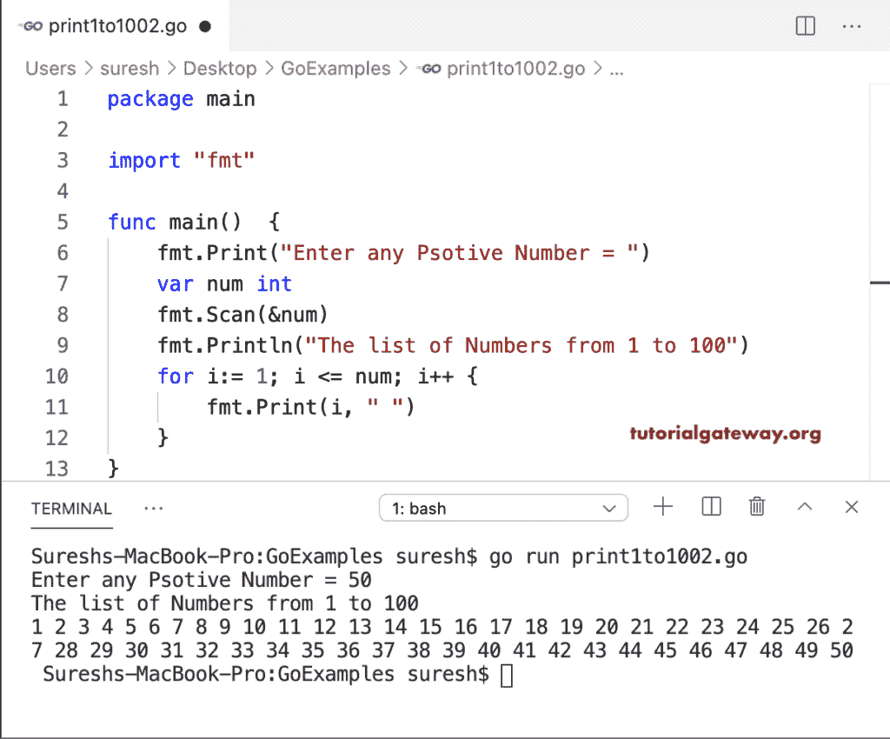

# Go 程序：打印 1 到 100

> 原文：<https://www.tutorialgateway.org/go-program-to-print-1-to-100/>

在这个打印 1 到 100 的 Go 程序中，我们使用 for 循环来迭代从 1 到 100 的数字。在循环中，我们使用 println 函数在每次迭代中打印数字。

```go
package main

import "fmt"

func main()  {
    fmt.Println("The list of Numbers from 1 to 100")
    for i:= 1; i <= 100; i++ {
        fmt.Print(i, " ")
    }
}
```

```go
The list of Numbers from 1 to 100
1 2 3 4 5 6 7 8 9 10 11 12 13 14 15 16 17 18 19 20 21 22 23 24 25 26 27 28 29 30 31 32 33 34 35 36 37 38 39 40 41 42 43 44 45 46 47 48 49 50 51 52 53 54 55 56 57 58 59 60 61 62 63 64 65 66 67 68 69 70 71 72 73 74 75 76 77 78 79 80 81 82 83 84 85 86 87 88 89 90 91 92 93 94 95 96 97 98 99 100
```

这个打印从 1 到 100 的自然数的 golang 程序允许用户输入自己的数字。接下来，[程序](https://www.tutorialgateway.org/go-programs/)打印从 1 到 num 的数字。

```go
package main

import "fmt"

func main()  {
    fmt.Print("Enter any Psotive Number = ")
    var num int
    fmt.Scan(&num)
    fmt.Println("The list of Numbers from 1 to 100")
    for i:= 1; i <= num; i++ {
        fmt.Print(i, " ")
    }
}
```

