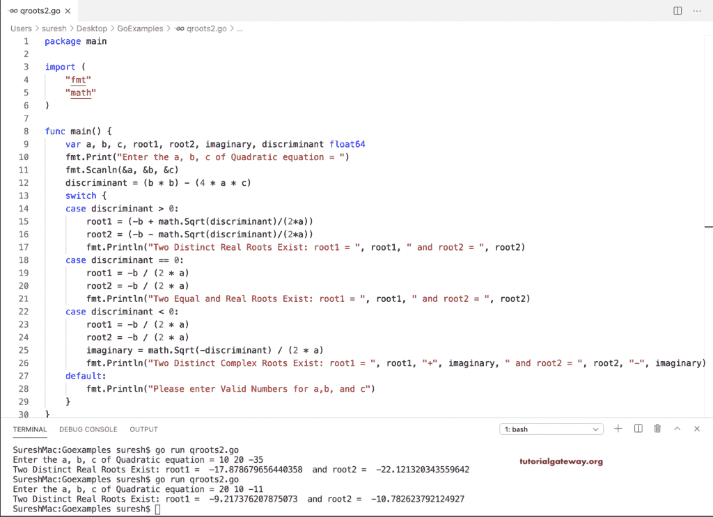

# Go 程序：求二次方程的根

> 原文：<https://www.tutorialgateway.org/go-program-to-find-roots-of-a-quadratic-equation/>

用 If Else 语句写一个求二次方程根的 Go 程序。二次方程的根(ax <sup>2</sup> +bx+c)取决于判别式值。

```go
package main

import (
    "fmt"
    "math"
)

func main() {

    var a, b, c, root1, root2, imaginary, discriminant float64

    fmt.Print("Enter the a, b, c of Quadratic equation = ")
    fmt.Scanln(&a, &b, &c)

    discriminant = (b * b) - (4 * a * c)

    if discriminant > 0 {
        root1 = (-b + math.Sqrt(discriminant)/(2*a))
        root2 = (-b - math.Sqrt(discriminant)/(2*a))
        fmt.Println("Two Distinct Real Roots Exist: root1 = ", root1, " and root2 = ", root2)
    } else if discriminant == 0 {
        root1 = -b / (2 * a)
        root2 = -b / (2 * a)
        fmt.Println("Two Equal and Real Roots Exist: root1 = ", root1, " and root2 = ", root2)
    } else if discriminant < 0 {
        root1 = -b / (2 * a)
        root2 = -b / (2 * a)
        imaginary = math.Sqrt(-discriminant) / (2 * a)
        fmt.Println("Two Distinct Complex Roots Exist: root1 = ", root1, "+", imaginary, " and root2 = ", root2, "-", imaginary)
    }
}
```

```go
SureshMac:GoExamples suresh$ go run qroots.go
Enter the a, b, c of Quadratic equation = 10 15 -25
Two Distinct Real Roots Exist: root1 =  -13.25  and root2 =  -16.75
SureshMac:GoExamples suresh$ go run qroots.go
Enter the a, b, c of Quadratic equation = 2 3 5
Two Distinct Complex Roots Exist: root1 =  -0.75 + 1.3919410907075054  and root2 =  -0.75 - 1.3919410907075054
```

## 用开关情况求二次方程根的 Golang 程序

```go
package main

import (
    "fmt"
    "math"
)

func main() {

    var a, b, c, root1, root2, imaginary, discriminant float64

    fmt.Print("Enter the a, b, c of Quadratic equation = ")
    fmt.Scanln(&a, &b, &c)

    discriminant = (b * b) - (4 * a * c)
    switch {
    case discriminant > 0:
        root1 = (-b + math.Sqrt(discriminant)/(2*a))
        root2 = (-b - math.Sqrt(discriminant)/(2*a))
        fmt.Println("Two Distinct Real Roots Exist: root1 = ", root1, " and root2 = ", root2)
    case discriminant == 0:
        root1 = -b / (2 * a)
        root2 = -b / (2 * a)
        fmt.Println("Two Equal and Real Roots Exist: root1 = ", root1, " and root2 = ", root2)
    case discriminant < 0:
        root1 = -b / (2 * a)
        root2 = -b / (2 * a)
        imaginary = math.Sqrt(-discriminant) / (2 * a)
        fmt.Println("Two Distinct Complex Roots Exist: root1 = ", root1, "+", imaginary, " and root2 = ", root2, "-", imaginary)
    default:
        fmt.Println("Please enter Valid Numbers for a,b, and c")
    }
}
```

