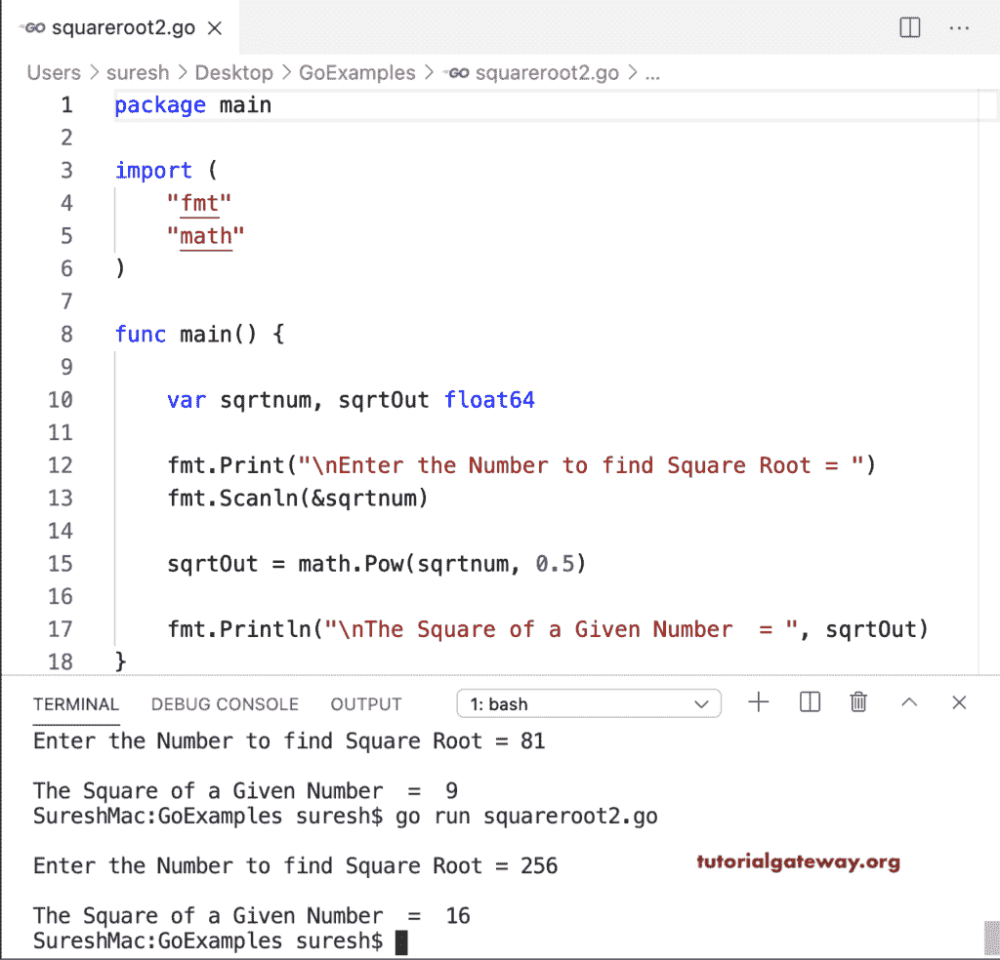

# Go 程序：计算一个数字的平方根

> 原文：<https://www.tutorialgateway.org/go-program-to-find-square-root-of-a-number/>

这个求一个数的平方根的 Go 程序使用内置的数学 sqrt 函数对用户给定的值进行运算。

```go
package main

import (
    "fmt"
    "math"
)

func main() {

    var sqrtnum, sqrtOut float64

    fmt.Print("\nEnter the Number to find Square Root = ")
    fmt.Scanln(&sqrtnum)

    sqrtOut = math.Sqrt(sqrtnum)

    fmt.Println("\nThe Square of a Given Number  = ", sqrtOut)
}
```

```go
SureshMac:GoExamples suresh$ go run squareroot1.go

Enter the Number to find Square Root = 64

The Square of a Given Number  =  8
SureshMac:GoExamples suresh$ go run squareroot1.go

Enter the Number to find Square Root = 82

The Square of a Given Number  =  9.055385138137417
```

## 求一个数的平方根的程序

这个 [golang 程序](https://www.tutorialgateway.org/go-programs/)使用数学幂函数计算给定数的平方根。

```go
package main

import (
    "fmt"
    "math"
)

func main() {

    var sqrtnum, sqrtOut float64

    fmt.Print("\nEnter the Number to find Square Root = ")
    fmt.Scanln(&sqrtnum)

    sqrtOut = math.Pow(sqrtnum, 0.5)

    fmt.Println("\nThe Square of a Given Number  = ", sqrtOut)
}
```

