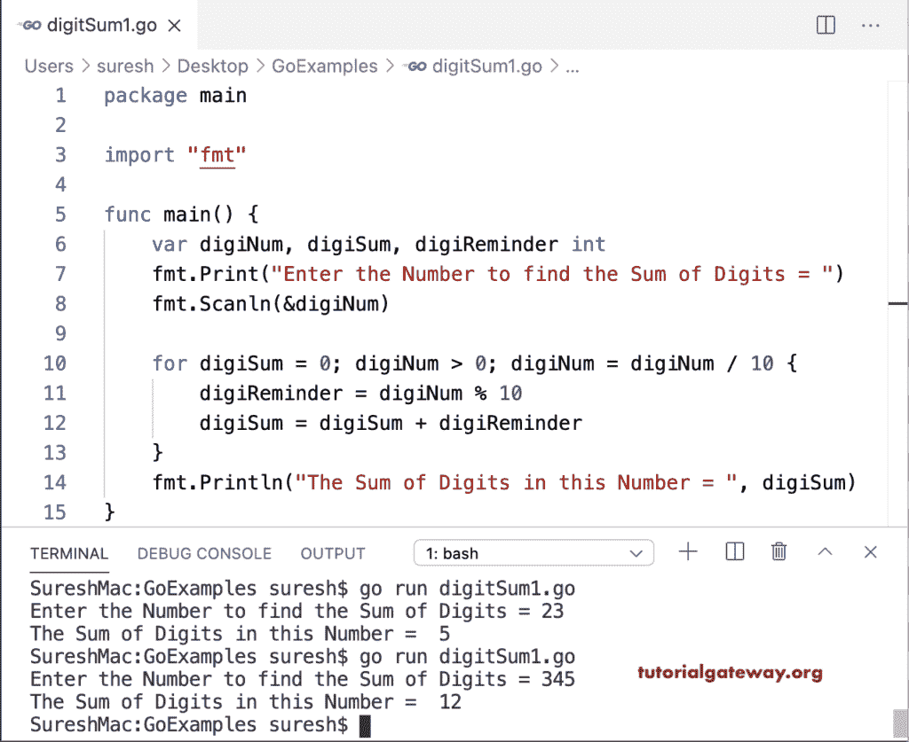

# Go 程序：查找数字的总和

> 原文：<https://www.tutorialgateway.org/go-program-to-find-sum-of-digits-in-a-number/>

写一个 Go 程序，用 for 循环求一个数字的和。for 循环条件确保该数字大于零。在这个循环中，

*   数字提醒=数字% 10–它将数字的最后一位数字添加到数字提醒中。
*   数字总和=数字总和+数字提醒->将最后一位数字加到数字总和。
*   digi num = digi num/10–它从数字中删除最后一个数字。

```go
package main

import "fmt"

func main() {

    var digiNum, digiSum, digiReminder int

    fmt.Print("Enter the Number to find the Sum of Digits = ")
    fmt.Scanln(&digiNum)

    for digiSum = 0; digiNum > 0; digiNum = digiNum / 10 {
        digiReminder = digiNum % 10
        digiSum = digiSum + digiReminder
    }
    fmt.Println("The Sum of Digits in this Number = ", digiSum)
}
```



## Go 程序：使用函数查找数字的总和

```go
package main

import "fmt"

var digiSum int

func digitSum(digiNum int) int {
    var digiReminder int

    for digiSum = 0; digiNum > 0; digiNum = digiNum / 10 {
        digiReminder = digiNum % 10
        digiSum = digiSum + digiReminder
    }
    return digiSum
}

func main() {

    var digiNum int

    fmt.Print("Enter the Number to find the Sum of Digits = ")
    fmt.Scanln(&digiNum)

    digiSum = digitSum(digiNum)
    fmt.Println("The Sum of Digits in this Number = ", digiSum)
}
```

```go
SureshMac:GoExamples suresh$ go run digitSum2.go
Enter the Number to find the Sum of Digits = 4567
The Sum of Digits in this Number =  22
SureshMac:GoExamples suresh$ go run digitSum2.go
Enter the Number to find the Sum of Digits = 98759
The Sum of Digits in this Number =  38
```

使用递归计算数字总和的 Golang 程序在这个 Golang 程序中，为了计算数字的总和，我们递归地调用 digitSum(digiNum/10)函数。

```go
package main

import "fmt"

var digiSum int

func digitSum(digiNum int) int {
    digiSum = 0
    if digiNum == 0 {
        return 0
    }
    digiSum = digiNum%10 + digitSum(digiNum/10)
    return digiSum
}

func main() {

    var digiNum int

    fmt.Print("Enter the Number to find the Sum of Digits = ")
    fmt.Scanln(&digiNum)

    digiSum = digitSum(digiNum)
    fmt.Println("The Sum of Digits in this Number = ", digiSum)
}
```

```go
SureshMac:GoExamples suresh$ go run digitSum3.go
Enter the Number to find the Sum of Digits = 45678
The Sum of Digits in this Number =  30
SureshMac:GoExamples suresh$ go run digitSum3.go
Enter the Number to find the Sum of Digits = 8098603
The Sum of Digits in this Number =  34
```