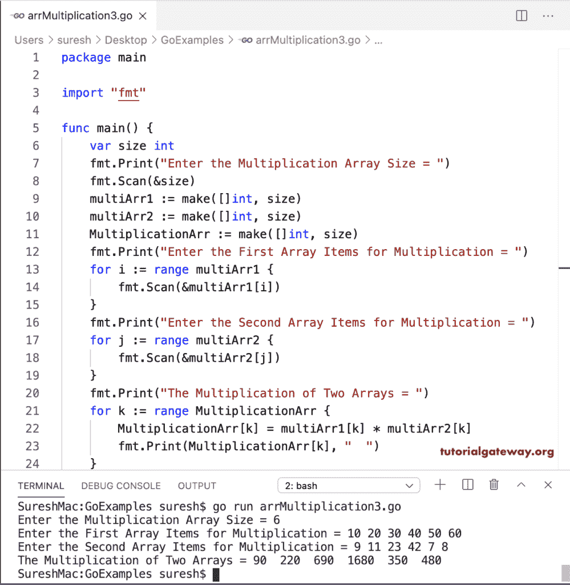

# Go 程序：数组乘法

> 原文：<https://www.tutorialgateway.org/go-array-multiplication-program/>

在这个 Go 数组乘法程序中，我们声明了三个固定大小的数组。在 for 循环中(对于 I = 0；i < len(乘法 arr)；i++)，我们执行两个数组的乘法，并将其分配给乘法数组。

```go
package main

import "fmt"

func main() {
    var i int

    var multiArr1 [5]int
    var multiArr2 [5]int
    var MultiplicationArr [5]int

    fmt.Print("Enter the First Array Items for Multiplication = ")
    for i = 0; i < 5; i++ {
        fmt.Scan(&multiArr1[i])
    }

    fmt.Print("Enter the Second Array Items for Multiplication = ")
    for i = 0; i < 5; i++ {
        fmt.Scan(&multiArr2[i])
    }

    fmt.Print("The Multiplication of Two Arrays = ")
    for i = 0; i < len(MultiplicationArr); i++ {
        MultiplicationArr[i] = multiArr1[i] * multiArr2[i]
        fmt.Print(MultiplicationArr[i], "  ")
    }
    fmt.Println()
}
```

```go
Enter the First Array Items for Multiplication = 1 2 3 4 5
Enter the Second Array Items for Multiplication = 9 11 22 3 7
The Multiplication of Two Arrays = 9  22  66  12  35 
```

## Go 程序：两个数组相乘示例

在这个 Golang 示例中，我们使用 for 循环范围(对于 j :=范围乘法 Arr)并执行数组乘法。

```go
package main

import "fmt"

func main() {
    var size, i int

    fmt.Print("Enter the Multiplication Array Size = ")
    fmt.Scan(&size)

    multiArr1 := make([]int, size)
    multiArr2 := make([]int, size)
    MultiplicationArr := make([]int, size)

    fmt.Print("Enter the First Array Items for Multiplication = ")
    for i = 0; i < size; i++ {
        fmt.Scan(&multiArr1[i])
    }

    fmt.Print("Enter the Second Array Items for Multiplication = ")
    for i = 0; i < size; i++ {
        fmt.Scan(&multiArr2[i])
    }

    fmt.Print("The Multiplication of Two Arrays = ")
    for j := range MultiplicationArr {
        MultiplicationArr[j] = multiArr1[j] * multiArr2[j]
        fmt.Print(MultiplicationArr[j], "  ")
    }
    fmt.Println()
}
```

```go
Enter the Multiplication Array Size = 4
Enter the First Array Items for Multiplication = 10 20 30 40
Enter the Second Array Items for Multiplication = 7 8 9 10
The Multiplication of Two Arrays = 70  160  270  400 
```

在这个用于两个数组相乘的 Golang 程序中，我们使用循环范围来分配数组项并相乘。

```go
package main

import "fmt"

func main() {
    var size, i int

    fmt.Print("Enter the Multiplication Array Size = ")
    fmt.Scan(&size)

    multiArr1 := make([]int, size)
    multiArr2 := make([]int, size)
    MultiplicationArr := make([]int, size)

    fmt.Print("Enter the First Array Items for Multiplication = ")
    for i := range multiArr1 {
        fmt.Scan(&multiArr1[i])
    }

    fmt.Print("Enter the Second Array Items for Multiplication = ")
    for j := range multiArr2 {
        fmt.Scan(&multiArr2[j])
    }

    fmt.Print("The Multiplication of Two Arrays = ")
    for k := range MultiplicationArr {
        MultiplicationArr[k] = multiArr1[k] * multiArr2[k]
        fmt.Print(MultiplicationArr[k], "  ")
    }
    fmt.Println()
}
```

