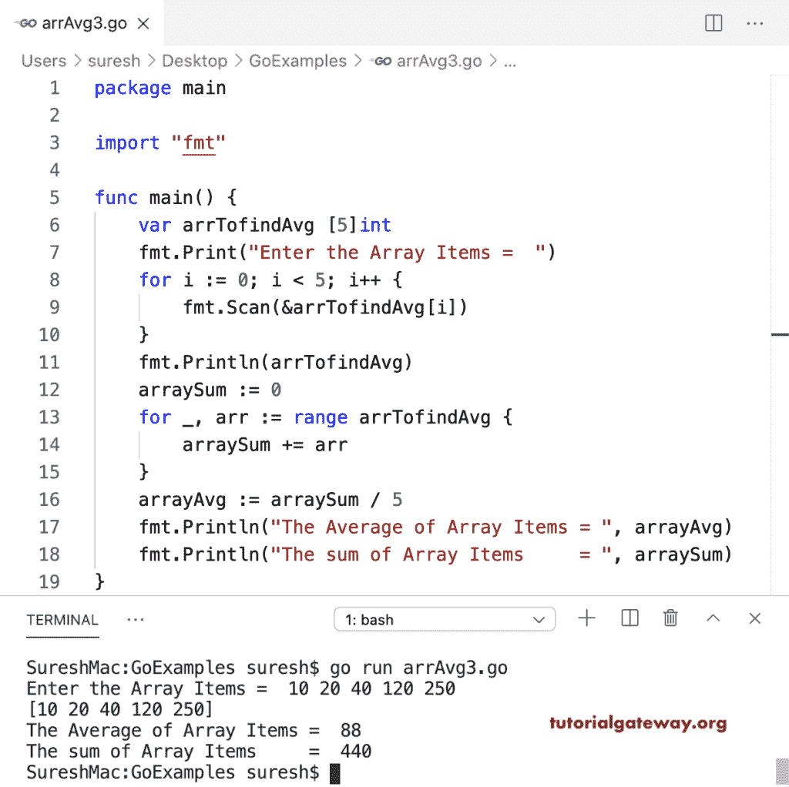

# Go 程序：计算阵列平均值

> 原文：<https://www.tutorialgateway.org/go-program-to-calculate-array-average/>

编写一个 Go 程序来计算数组项的平均值。这个 Golang 示例中的 for 循环将数组项从零迭代到五。在循环内(对于 I:= 0；I < 5；i++)，我们正在计算数组项的总和。接下来，我们将数组和除以数组大小或长度，即 5，得到平均值。

```go
package main

import "fmt"

func main() {
    arrTofindAvg := [5]int{10, 20, 30, 40, 50}
    fmt.Println(arrTofindAvg)

    arraySum := 0

    for i := 0; i < 5; i++ {
        arraySum += arrTofindAvg[i]
    }

    arrayAvg := arraySum / 5
    fmt.Println("The Average of Array Items = ", arrayAvg)
    fmt.Println("The sum of Array Items     = ", arraySum)
}
```

```go
[10 20 30 40 50]
The Average of Array Items =  30
The sum of Array Items     =  150
```

转到程序来计算用于循环范围的数组项目的平均值。

```go
package main

import "fmt"

func main() {
    arrTofindAvg := [7]int{15, 25, 35, 45, 55, 65, 75}
    fmt.Println(arrTofindAvg)

    arraySum := 0

    for _, arr := range arrTofindAvg {
        arraySum += arr
    }

    arrayAvg := arraySum / 7
    fmt.Println("The Average of Array Items = ", arrayAvg)
    fmt.Println("The sum of Array Items     = ", arraySum)
}
```

```go
[15 25 35 45 55 65 75]
The Average of Array Items =  45
The sum of Array Items     =  315
```

这个 Golang 程序允许输入数组项目，并计算这些数组元素的平均值。

```go
package main

import "fmt"

func main() {
    var arrTofindAvg [5]int

    fmt.Print("Enter the Array Items =  ")
    for i := 0; i < 5; i++ {
        fmt.Scan(&arrTofindAvg[i])
    }

    fmt.Println(arrTofindAvg)

    arraySum := 0

    for _, arr := range arrTofindAvg {
        arraySum += arr
    }

    arrayAvg := arraySum / 5
    fmt.Println("The Average of Array Items = ", arrayAvg)
    fmt.Println("The sum of Array Items     = ", arraySum)
}
```

