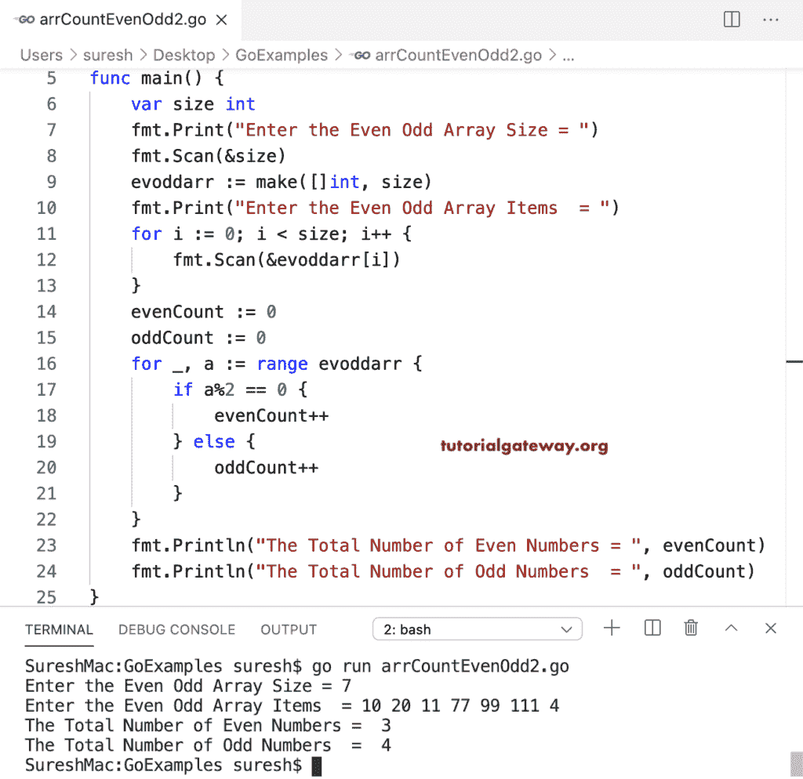

# Go 程序：统计数组中偶数和奇数

> 原文：<https://www.tutorialgateway.org/go-program-to-count-even-and-odd-numbers-in-an-array/>

在这个计算数组中偶数和奇数的 Go 程序中，我们使用 for 循环来迭代数组。if 条件(if Evo ddar[I]% 2 = = 0)检查数组元素是否可被等于零的 2 整除。如果为真，我们增加偶数计数(even count++)；否则，递增奇数计数值(oddCount++)。

```go
package main

import "fmt"

func main() {
    var size, i int

    fmt.Print("Enter the Even Odd Array Size = ")
    fmt.Scan(&size)

    evoddarr := make([]int, size)

    fmt.Print("Enter the Even Odd Array Items  = ")
    for i = 0; i < size; i++ {
        fmt.Scan(&evoddarr[i])
    }

    evenCount := 0
    oddCount := 0

    for i = 0; i < size; i++ {
        if evoddarr[i]%2 == 0 {
            evenCount++
        } else {
            oddCount++
        }
    }
    fmt.Println("The Total Number of Even Numbers = ", evenCount)
    fmt.Println("The Total Number of Odd Numbers  = ", oddCount)
}
```

```go
Enter the Even Odd Array Size = 5
Enter the Even Odd Array Items  = 1 2 3 4 5
The Total Number of Even Numbers =  2
The Total Number of Odd Numbers  =  3
```

Golang 程序使用 for 循环范围来计数数组中的偶数和奇数。

```go
package main

import (
    "fmt"
)

func main() {
    var size int

    fmt.Print("Enter the Even Odd Array Size = ")
    fmt.Scan(&size)

    evoddarr := make([]int, size)

    fmt.Print("Enter the Even Odd Array Items  = ")
    for i := 0; i < size; i++ {
        fmt.Scan(&evoddarr[i])
    }

    evenCount := 0
    oddCount := 0

    for _, a := range evoddarr {
        if a%2 == 0 {
            evenCount++
        } else {
            oddCount++
        }
    }
    fmt.Println("The Total Number of Even Numbers = ", evenCount)
    fmt.Println("The Total Number of Odd Numbers  = ", oddCount)
}
```



在这个 Go 奇偶数组示例中，我们创建了两个单独的函数(func countEvenNums(evoddarr[]int)和 func countOddNums)，它们返回偶数和奇数的计数。

```go
package main

import "fmt"

var evenCount, oddCount int

func countEvenNums(evoddarr []int) int {
    evenCount = 0
    fmt.Print("\nList of Even Numbers  = ")
    for _, a := range evoddarr {
        if a%2 == 0 {
            fmt.Print(a, " ")
            evenCount++
        }
    }
    return evenCount
}
func countOddNums(evoddarr []int) int {
    oddCount = 0
    fmt.Print("\nList of Odd Numbers   = ")
    for _, a := range evoddarr {
        if a%2 != 0 {
            fmt.Print(a, " ")
            oddCount++
        }
    }
    return oddCount
}
func main() {
    var size int

    fmt.Print("Enter the Even Odd Array Size = ")
    fmt.Scan(&size)

    evoddarr := make([]int, size)

    fmt.Print("Enter the Even Odd Array Items  = ")
    for i := 0; i < size; i++ {
        fmt.Scan(&evoddarr[i])
    }

    evenCount = countEvenNums(evoddarr)
    oddCount = countOddNums(evoddarr)
    fmt.Println("\nThe Total Number of Even Numbers = ", evenCount)
    fmt.Println("The Total Number of Odd Numbers  = ", oddCount)
}
```

```go
Enter the Even Odd Array Size = 8
Enter the Even Odd Array Items  = 11 22 8 33 98 9 19 0

List of Even Numbers  = 22 8 98 0 
List of Odd Numbers   = 11 33 9 19 
The Total Number of Even Numbers =  4
The Total Number of Odd Numbers  =  4
```