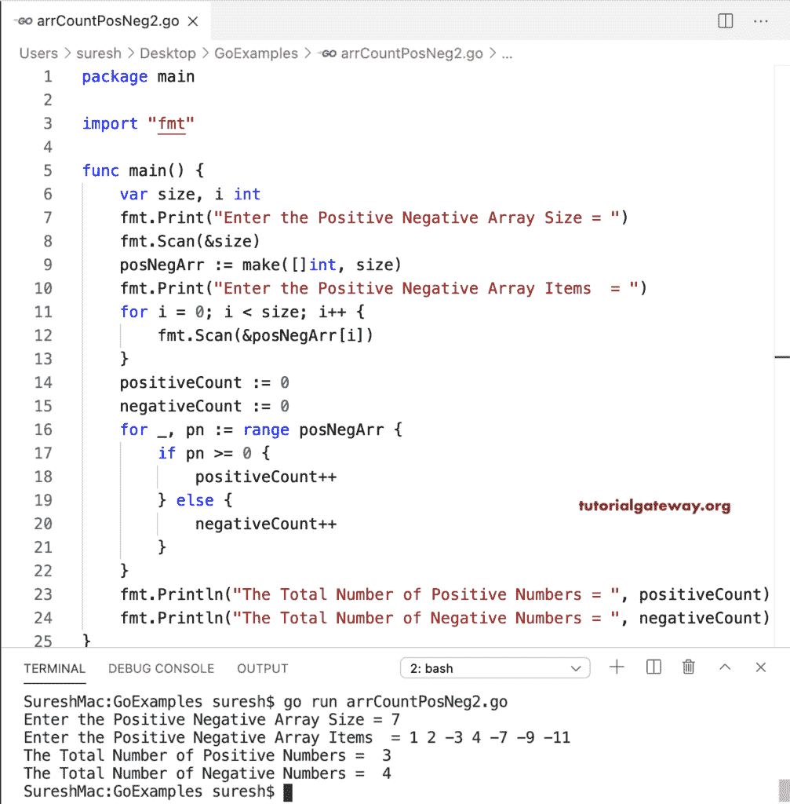

# Go 程序：统计数组中的正数和负数

> 原文：<https://www.tutorialgateway.org/go-program-to-count-positive-and-negative-numbers-in-an-array/>

在这个计算数组中正数和负数的 Go 程序中，我们使用 for 循环来迭代 posNegArr 数组。if 条件(if posNegArr[i] >= 0)检查数组元素是否大于或等于零。如果为真，我们增加正计数(positive count++)；否则，递增(否定计数++)负计数值。

```go
package main

import "fmt"

func main() {
    var size, i int

    fmt.Print("Enter the Positive Negative Array Size = ")
    fmt.Scan(&size)

    posNegArr := make([]int, size)

    fmt.Print("Enter the Positive Negative Array Items  = ")
    for i = 0; i < size; i++ {
        fmt.Scan(&posNegArr[i])
    }

    positiveCount := 0
    negativeCount := 0

    for i = 0; i < size; i++ {
        if posNegArr[i] >= 0 {
            positiveCount++
        } else {
            negativeCount++
        }
    }
    fmt.Println("The Total Number of Positive Numbers = ", positiveCount)
    fmt.Println("The Total Number of Negative Numbers = ", negativeCount)
}
```

```go
Enter the Positive Negative Array Size = 5
Enter the Positive Negative Array Items  = 1 -2 -3 0 -5
The Total Number of Positive Numbers =  2
The Total Number of Negative Numbers =  3
```

Golang 使用 for 循环范围对数组中的正数和负数进行计数的程序。

```go
package main

import "fmt"

func main() {
    var size, i int

    fmt.Print("Enter the Positive Negative Array Size = ")
    fmt.Scan(&size)

    posNegArr := make([]int, size)

    fmt.Print("Enter the Positive Negative Array Items  = ")
    for i = 0; i < size; i++ {
        fmt.Scan(&posNegArr[i])
    }

    positiveCount := 0
    negativeCount := 0

    for _, pn := range posNegArr {
        if pn >= 0 {
            positiveCount++
        } else {
            negativeCount++
        }
    }
    fmt.Println("The Total Number of Positive Numbers = ", positiveCount)
    fmt.Println("The Total Number of Negative Numbers = ", negativeCount)
}
```



在这个 Go 数组的例子中，我们创建了两个独立的函数(func countppositivenums & countbenums)，它们返回正数和负数的计数。

```go
package main

import "fmt"

var positiveCount, negativeCount int

func countPositiveNums(posNegArr []int) int {
    positiveCount = 0
    for _, pn := range posNegArr {
        if pn >= 0 {
            positiveCount++
        }
    }
    return positiveCount
}
func countNegativeNums(posNegArr []int) int {
    negativeCount = 0
    for _, pn := range posNegArr {
        if pn < 0 {
            negativeCount++
        }
    }
    return negativeCount
}
func main() {
    var size int

    fmt.Print("Enter the positive negative Array Size = ")
    fmt.Scan(&size)

    posNegArr := make([]int, size)

    fmt.Print("Enter the positive negative Array Items  = ")
    for i := 0; i < size; i++ {
        fmt.Scan(&posNegArr[i])
    }

    positiveCount = countPositiveNums(posNegArr)
    negativeCount = countNegativeNums(posNegArr)
    fmt.Println("The Total Number of positive Numbers = ", positiveCount)
    fmt.Println("The Total Number of negative Numbers = ", negativeCount)
}
```

```go
Enter the positive negative Array Size = 9
Enter the positive negative Array Items  = -2 -3 0 -9 11 22 33 -88 100
The Total Number of positive Numbers =  5
The Total Number of negative Numbers =  4
```