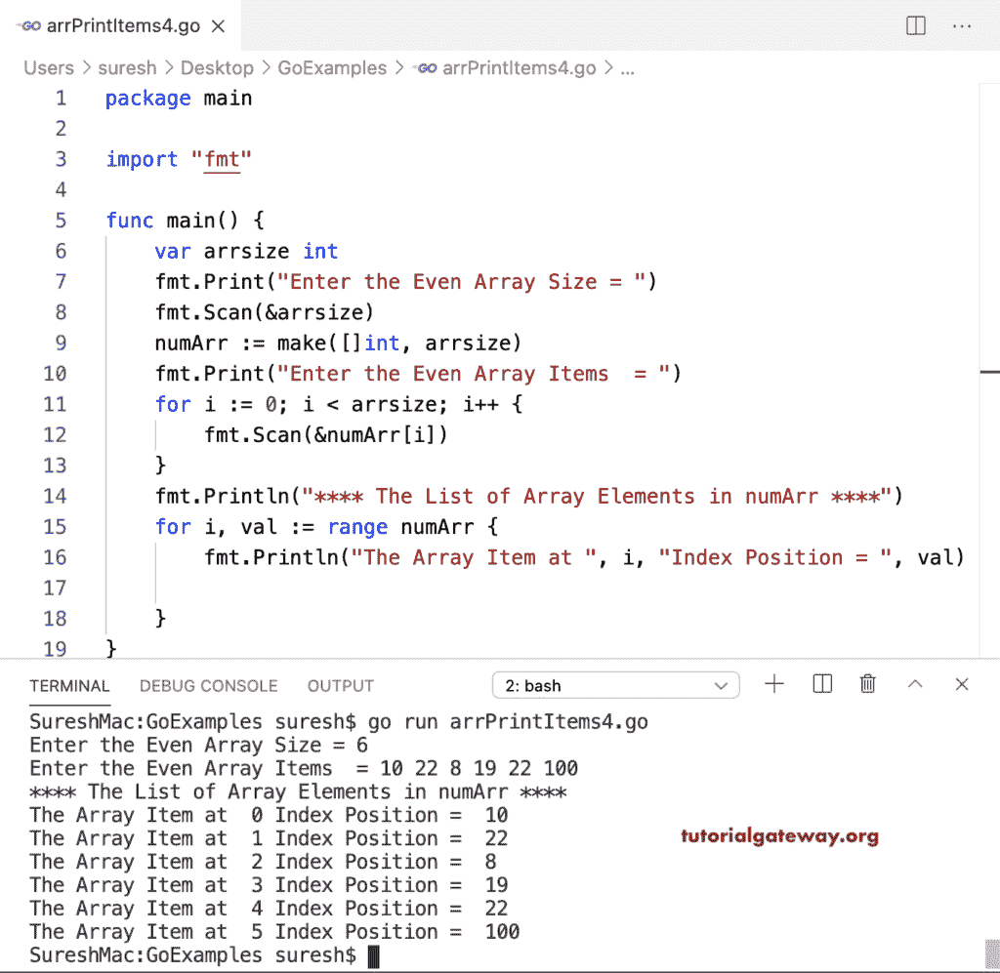

# Go 程序：打印数组项目

> 原文：<https://www.tutorialgateway.org/go-program-to-print-array-items/>

在这个打印数组项目的 Go 程序中，我们声明了一个由五个整数值组成的数组。我们可以使用 println 语句来打印数组项。

```go
package main

import "fmt"

func main() {

    numArr := [5]int{10, 20, 30, 50, 70}

    fmt.Println(numArr)
}
```

```go
[10 20 30 50 70]
```

## 使用 For 循环转到程序打印数组项目

for 循环的 Golang 从 0 迭代到 5(最大大小)(对于 I:= 0；我< 5; i++) and prints the array items.

```go
package main

import "fmt"

func main() {

    numArr := [5]int{10, 20, 30, 50, 70}

    fmt.Print("\nThe List of Array Elements in numArr = ")
    for i := 0; i < 5; i++ {
        fmt.Print(numArr[i], "  ")
    }
    fmt.Println()
}
```

```go
The List of Array Elements in numArr = 10  20  30  50  70 
```

在这个 Golang 例子中，我们使用了数组的长度(对于 I:= 0；I < len(Numarr)；i++)作为 for 循环条件。

```go
package main

import "fmt"

func main() {

    numArr := [7]int{22, 19, 15, 62, 37, 50, 70}

    fmt.Println("The List of Array Elements in numArr = ")
    for i := 0; i < len(numArr); i++ {
        fmt.Println("The Array Item at ", i, "Index Position = ", numArr[i])
    }
}
```

```go
The List of Array Elements in numArr = 
The Array Item at  0 Index Position =  22
The Array Item at  1 Index Position =  19
The Array Item at  2 Index Position =  15
The Array Item at  3 Index Position =  62
The Array Item at  4 Index Position =  37
The Array Item at  5 Index Position =  50
The Array Item at  6 Index Position =  70
```

这个 [Go 程序](https://www.tutorialgateway.org/go-programs/)允许用户输入大小和数组项目。接下来，我们打印这些数组项。

```go
package main

import "fmt"

func main() {

    var arrsize, i int
    var numArr [10]int

    fmt.Print("Enter the Even Array Size = ")
    fmt.Scan(&arrsize)

    fmt.Print("Enter the Even Array Items  = ")
    for i = 0; i < arrsize; i++ {
        fmt.Scan(&numArr[i])
    }

    fmt.Println("**** The List of Array Elements in numArr ****")
    for i = 0; i < arrsize; i++ {
        fmt.Println("The Array Item at ", i, "Index Position = ", numArr[i])
    }
}
```

```go
Enter the Even Array Size = 5
Enter the Even Array Items  = 2 5 7 9 3
**** The List of Array Elements in numArr ****
The Array Item at  0 Index Position =  2
The Array Item at  1 Index Position =  5
The Array Item at  2 Index Position =  7
The Array Item at  3 Index Position =  9
The Array Item at  4 Index Position =  3
```

这个 Golang 程序使用 For 循环范围(对于 I，val:= Range numerr)返回数组项。这里，I 是索引位置，val 是实际值。

```go
package main

import "fmt"

func main() {

    var arrsize int

    fmt.Print("Enter the Even Array Size = ")
    fmt.Scan(&arrsize)

    numArr := make([]int, arrsize)

    fmt.Print("Enter the Even Array Items  = ")
    for i := 0; i < arrsize; i++ {
        fmt.Scan(&numArr[i])
    }

    fmt.Println("**** The List of Array Elements in numArr ****")
    for i, val := range numArr {
        fmt.Println("The Array Item at ", i, "Index Position = ", val)

    }
}
```

