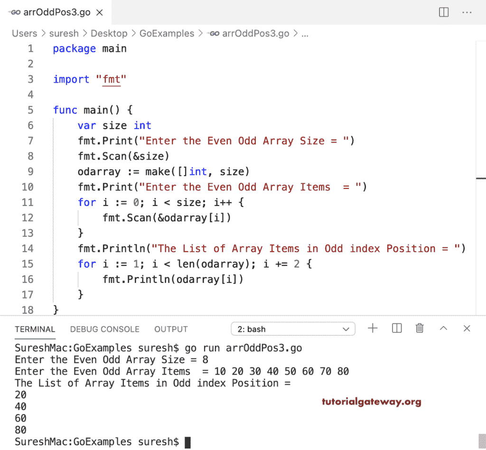

# Go 程序：打印奇数索引位置的数组项目

> 原文：<https://www.tutorialgateway.org/go-program-to-print-array-items-in-odd-index-position/>

编写一个 Go 程序，使用 For 循环打印奇数索引位置(而不是实际的奇数位置)的数组项。这里，for 循环(对于 I:= 1；I < len(odarray)；i += 2)从 1 开始迭代，并以 2 递增，直到数组长度。在循环中，我们在奇数位置打印所有数组项。

```go
package main

import "fmt"

func main() {

    odarray := []int{11, 12, 32, 45, 65, 90, 70, 80}

    fmt.Println("The List of Array Items in Odd Index Position = ")
    for i := 1; i < len(odarray); i += 2 {
        fmt.Println(odarray[i])
    }
}
```

```go
The List of Array Items in Odd Index Position = 
12
45
90
80
```

## 使用 For 循环范围打印奇数索引位置的数组项目的 Golang 程序

我们使用了一个额外的 if 语句(if i%2！= 0)检查可被二整除的索引位置是否不等于零，这意味着它是一个奇数索引位置。接下来，打印那个号码。

```go
package main

import "fmt"

func main() {

    odarray := []int{11, 12, 32, 45, 65, 90, 70, 80}

    fmt.Println("The List of Array Items in Odd Index Position = ")
    for i, _ := range odarray {
        if i%2 != 0 {
            fmt.Println(odarray[i])
        }
    }
}
```

```go
The List of Array Items in Odd Index Position = 
12
45
90
80
```

这个 Golang 程序允许输入数组大小和项目，并在一个奇数索引位置平移元素。

```go
package main

import "fmt"

func main() {

    var size int

    fmt.Print("Enter the Even Odd Array Size = ")
    fmt.Scan(&size)

    odarray := make([]int, size)

    fmt.Print("Enter the Even Odd Array Items  = ")
    for i := 0; i < size; i++ {
        fmt.Scan(&odarray[i])
    }

    fmt.Println("The List of Array Items in Odd index Position = ")
    for i := 1; i < len(odarray); i += 2 {
        fmt.Println(odarray[i])
    }
}
```

