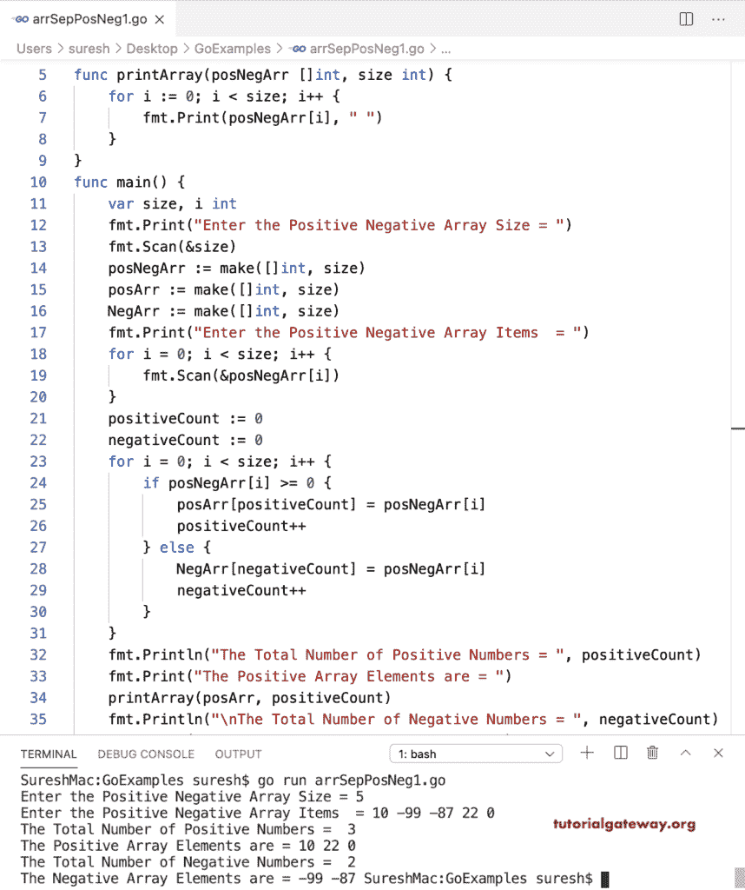

# Go 程序：将正片和负片放在单独的数组中

> 原文：<https://www.tutorialgateway.org/go-program-to-put-positive-and-negatives-in-a-separate-array/>

编写一个 Go 程序，使用 for 循环将正数和负数放在一个单独的数组中。首先，我们声明了三个数组。if 条件(if posNegArr[i] >= 0)检查循环中的数组项是否大于或等于零。如果为真，我们将该值赋给 posArr(posArr[positiveCount]= posNegArr[I])，并增加正计数值。否则，将该值设置为 NegArr(NegArr[否定计数] = posNegArr[i])，并增加负计数值。接下来，我们创建了一个函数(printArray(posNegArr []int，size int))来打印正负数组项。

```go
package main

import "fmt"

func printArray(posNegArr []int, size int) {
    for i := 0; i < size; i++ {
        fmt.Print(posNegArr[i], " ")
    }
}
func main() {
    var size, i int

    fmt.Print("Enter the Positive Negative Array Size = ")
    fmt.Scan(&size)

    posNegArr := make([]int, size)
    posArr := make([]int, size)
    NegArr := make([]int, size)

    fmt.Print("Enter the Positive Negative Array Items  = ")
    for i = 0; i < size; i++ {
        fmt.Scan(&posNegArr[i])
    }

    positiveCount := 0
    negativeCount := 0

    for i = 0; i < size; i++ {
        if posNegArr[i] >= 0 {
            posArr[positiveCount] = posNegArr[i]
            positiveCount++
        } else {
            NegArr[negativeCount] = posNegArr[i]
            negativeCount++
        }
    }
    fmt.Println("The Total Number of Positive Numbers = ", positiveCount)
    fmt.Print("The Positive Array Elements are = ")
    printArray(posArr, positiveCount)
    fmt.Println("The Total Number of Negative Numbers = ", negativeCount)
    fmt.Print("The Negative Array Elements are = ")
    printArray(NegArr, negativeCount)
}
```



## 将正数和负数放入单独数组的 Golang 程序

在这个 Go 示例中，我们创建了两个独立的函数(putPositiveNums 和 putNegativeNums)，它们将正数放在负数数组中的正数和负数中。

```go
package main

import "fmt"

var positiveCount, negativeCount, i int

func printArray(posNegArr []int, size int) {
    for i = 0; i < size; i++ {
        fmt.Print(posNegArr[i], " ")
    }
}
func putPositiveNums(posNegArr []int, size int) {
    posArr := make([]int, size)
    positiveCount = 0
    for i = 0; i < size; i++ {
        if posNegArr[i] >= 0 {
            posArr[positiveCount] = posNegArr[i]
            positiveCount++
        }
    }
    fmt.Println("The Total Number of Positive Numbers = ", positiveCount)
    fmt.Print("The Positive Array Elements are = ")
    printArray(posArr, positiveCount)
}
func putNegativeNums(posNegArr []int, size int) {
    NegArr := make([]int, size)
    negativeCount = 0
    for i = 0; i < size; i++ {
        if posNegArr[i] < 0 {
            NegArr[negativeCount] = posNegArr[i]
            negativeCount++
        }
    }
    fmt.Println("\nThe Total Number of Negative Numbers = ", negativeCount)
    fmt.Print("The Negative Array Elements are = ")
    printArray(NegArr, negativeCount)
}
func main() {
    var size, i int

    fmt.Print("Enter the Positive Negative Array Size = ")
    fmt.Scan(&size)

    posNegArr := make([]int, size)

    fmt.Print("Enter the Positive Negative Array Items  = ")
    for i = 0; i < size; i++ {
        fmt.Scan(&posNegArr[i])
    }

    putPositiveNums(posNegArr, size)
    putNegativeNums(posNegArr, size)
    fmt.Println()

}
```

```go
Enter the Positive Negative Array Size = 8
Enter the Positive Negative Array Items  = 10 -22 -88 0 -77 5 -12 100
The Total Number of Positive Numbers =  4
The Positive Array Elements are = 10 0 5 100 
The Total Number of Negative Numbers =  4
The Negative Array Elements are = -22 -88 -77 -12 
```