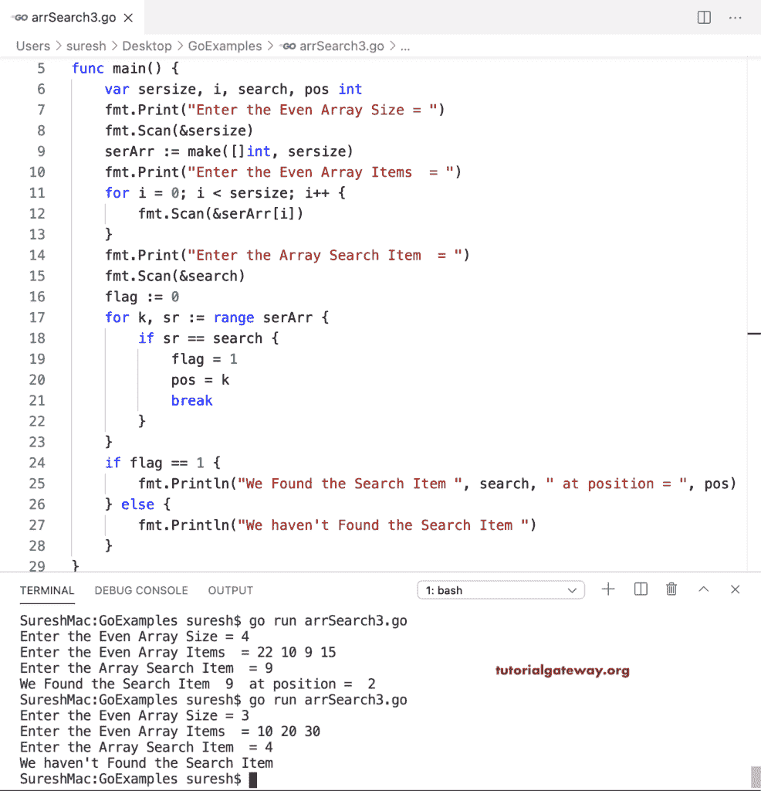

# Go 程序：搜索数组项目

> 原文：<https://www.tutorialgateway.org/go-program-to-search-for-array-items/>

在这个 Go 程序中，我们使用 for 循环来迭代和搜索数组项，并打印索引位置。这里，我们使用 If 语句(if serArr[i] == search)来检查是否有任何数组项等于搜索值。一旦找到，标志值将为 1(标志= 1)，中断将从 for 循环退出 GC。接下来，我们使用 If else 语句。如果 flag 等于 1(如果 flag == 1)，那么我们在数组中找到了搜索项。否则，我们还没找到。

```go
package main

import "fmt"

func main() {
    var sersize, i, search int

    fmt.Print("Enter the Even Array Size = ")
    fmt.Scan(&sersize)

    serArr := make([]int, sersize)

    fmt.Print("Enter the Even Array Items  = ")
    for i = 0; i < sersize; i++ {
        fmt.Scan(&serArr[i])
    }
    fmt.Print("Enter the Array Search Item  = ")
    fmt.Scan(&search)
    flag := 0
    for i = 0; i < sersize; i++ {
        if serArr[i] == search {
            flag = 1
            break
        }
    }
    if flag == 1 {
        fmt.Println("We Found the Search Item ", search, " at position = ", i)
    } else {
        fmt.Println("We haven't Found the Search Item ")
    }
}
```

```go
Enter the Even Array Size = 3
Enter the Even Array Items  = 10 20 30
Enter the Array Search Item  = 20
We Found the Search Item  20  at position =  1
```

## Go 程序：使用 for 循环范围在数组中搜索项目

在这个例子中，我们在循环中使用了 println 语句。它可以显示搜索项目。但是这个[程序](https://www.tutorialgateway.org/go-programs/)如果没有找到我们要找的东西就不显示任何东西。

```go
package main

import "fmt"

func main() {
    var sersize, i, search int

    fmt.Print("Enter the Even Array Size = ")
    fmt.Scan(&sersize)

    serArr := make([]int, sersize)

    fmt.Print("Enter the Even Array Items  = ")
    for i = 0; i < sersize; i++ {
        fmt.Scan(&serArr[i])
    }
    fmt.Print("Enter the Array Search Item  = ")
    fmt.Scan(&search)

    for k, sr := range serArr {
        if sr == search {
            fmt.Println("We Found the Search Item ", search, " at position = ", k)
            break
        }
    }
}
```

```go
Enter the Even Array Size = 5
Enter the Even Array Items  = 20 30 40 20 50
Enter the Array Search Item  = 20
We Found the Search Item  20  at position =  0
```

在这个搜索数组项目的 Golang 程序中，我们将 if-else 语句放在循环之外，以显示未找到的结果。

```go
package main

import "fmt"

func main() {
    var sersize, i, search, pos int

    fmt.Print("Enter the Even Array Size = ")
    fmt.Scan(&sersize)

    serArr := make([]int, sersize)

    fmt.Print("Enter the Even Array Items  = ")
    for i = 0; i < sersize; i++ {
        fmt.Scan(&serArr[i])
    }
    fmt.Print("Enter the Array Search Item  = ")
    fmt.Scan(&search)
    flag := 0
    for k, sr := range serArr {
        if sr == search {
            flag = 1
            pos = k
            break
        }
    }
    if flag == 1 {
        fmt.Println("We Found the Search Item ", search, " at position = ", pos)
    } else {
        fmt.Println("We haven't Found the Search Item ")
    }
}
```

