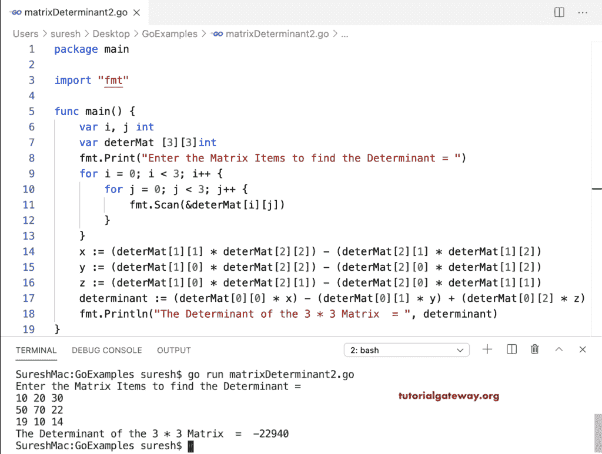

# Go 程序：计算矩阵行列式

> 原文：<https://www.tutorialgateway.org/go-program-to-find-matrix-determinant/>

这个 Go 程序求 2 * 2 矩阵的行列式。首先，它允许输入矩阵项，然后使用数学公式找到矩阵行列式。

```go
package main

import "fmt"

func main() {
    var i, j int

    var deterMat [2][2]int

    fmt.Print("Enter the Matrix Items to find the Determinant = ")
    for i = 0; i < 2; i++ {
        for j = 0; j < 2; j++ {
            fmt.Scan(&deterMat[i][j])
        }
    }

    determinant := (deterMat[0][0] * deterMat[1][1]) - (deterMat[0][1] * deterMat[1][0])
    fmt.Println("The Determinant of the 2 * 2 Matrix  = ", determinant)
}
```

```go
Enter the Matrix Items to find the Determinant = 
10 25
19 50
The Determinant of the 2 * 2 Matrix  =  25
```

这个 Golang 程序计算 3 * 3 矩阵行列式。

```go
package main

import "fmt"

func main() {
    var i, j int

    var deterMat [3][3]int

    fmt.Print("Enter the Matrix Items to find the Determinant = ")
    for i = 0; i < 3; i++ {
        for j = 0; j < 3; j++ {
            fmt.Scan(&deterMat[i][j])
        }
    }

    x := (deterMat[1][1] * deterMat[2][2]) - (deterMat[2][1] * deterMat[1][2])
    y := (deterMat[1][0] * deterMat[2][2]) - (deterMat[2][0] * deterMat[1][2])
    z := (deterMat[1][0] * deterMat[2][1]) - (deterMat[2][0] * deterMat[1][1])

    determinant := (deterMat[0][0] * x) - (deterMat[0][1] * y) + (deterMat[0][2] * z)
    fmt.Println("The Determinant of the 3 * 3 Matrix  = ", determinant)
}
```

