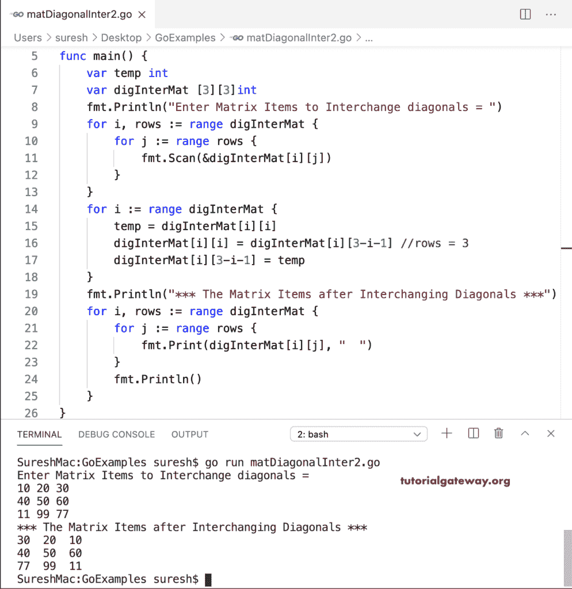

# Go 程序：交换矩阵对角线

> 原文：<https://www.tutorialgateway.org/go-program-to-interchange-matrix-diagonals/>

写一个 Go 程序来交换矩阵中的对角项。首先，它(如果行==列)检查给定的矩阵是否是正方形的。接下来，我们使用临时变量来交换对角线项。最后一个 for 循环在交换对角线后打印矩阵。

```go
package main

import "fmt"

func main() {
    var i, j, rows, columns, temp int

    var digInterMat [10][10]int

    fmt.Print("Enter the Matrix rows and Columns = ")
    fmt.Scan(&rows, &columns)

    fmt.Println("Enter Matrix Items to Interchange diagonals = ")
    for i = 0; i < rows; i++ {
        for j = 0; j < columns; j++ {
            fmt.Scan(&digInterMat[i][j])
        }
    }
    if rows == columns {
        for i = 0; i < rows; i++ {
            temp = digInterMat[i][i]
            digInterMat[i][i] = digInterMat[i][rows-i-1]
            digInterMat[i][rows-i-1] = temp
        }
        fmt.Println("*** The Matrix Items after Interchanging Diagonals ***")
        for i = 0; i < rows; i++ {
            for j = 0; j < columns; j++ {
                fmt.Print(digInterMat[i][j], "  ")
            }
            fmt.Println()
        }
    } else {
        fmt.Println("The Given Matrix is Not a Square Matrix")
    }
}
```

```go
Enter the Matrix rows and Columns = 2 2
Enter Matrix Items to Interchange diagonals = 
1 2
9 8
*** The Matrix Items after Interchanging Diagonals ***
2  1  
8  9 
```

## 利用 For 循环范围交换矩阵对角线的 Golang 程序

我们删除了额外的 If else 来检查方形矩阵，因为我们将矩阵初始化为 3 * 3。

```go
package main

import "fmt"

func main() {
    var temp int

    var digInterMat [3][3]int

    fmt.Println("Enter Matrix Items to Interchange diagonals = ")
    for i, rows := range digInterMat {
        for j := range rows {
            fmt.Scan(&digInterMat[i][j])
        }
    }
    for i := range digInterMat {
        temp = digInterMat[i][i]
        digInterMat[i][i] = digInterMat[i][3-i-1] //rows = 3
        digInterMat[i][3-i-1] = temp
    }
    fmt.Println("*** The Matrix Items after Interchanging Diagonals ***")
    for i, rows := range digInterMat {
        for j := range rows {
            fmt.Print(digInterMat[i][j], "  ")
        }
        fmt.Println()
    }
}
```

