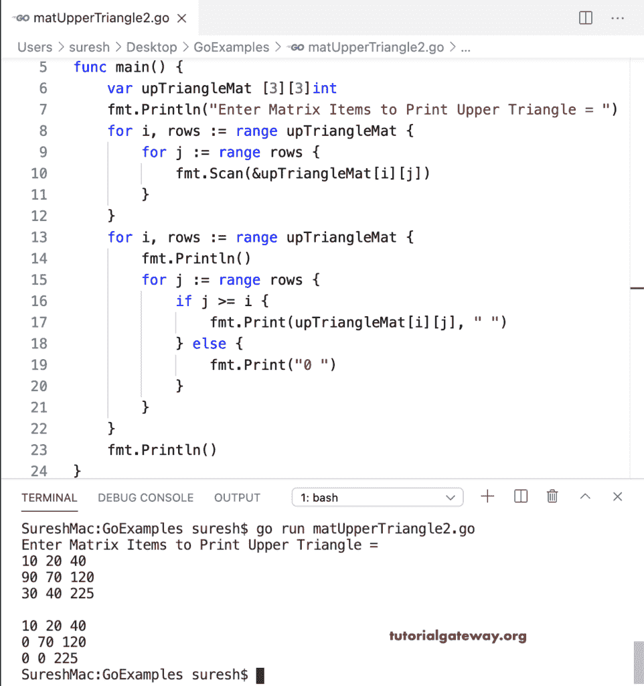

# Go 程序：打印矩阵上三角形

> 原文：<https://www.tutorialgateway.org/go-program-to-print-matrix-upper-triangle/>

写一个 Go 程序来打印矩阵的上三角。在这个 Go Matrix 上三角形示例中，嵌套 for 循环迭代矩阵行和列。在循环中，if 语句(if j >= i)验证列值是否大于或等于行值。如果为真，则将该项打印为上三角矩阵项，如果条件为假，则打印零。

```go
package main

import "fmt"

func main() {
    var i, j, rows, columns int

    var upTriangleMat [10][10]int

    fmt.Print("Enter the Upper Matrix rows and Columns = ")
    fmt.Scan(&rows, &columns)

    fmt.Println("Enter Matrix Items to Print Upper Triangle = ")
    for i = 0; i < rows; i++ {
        for j = 0; j < columns; j++ {
            fmt.Scan(&upTriangleMat[i][j])
        }
    }
    for i = 0; i < rows; i++ {
        fmt.Println()
        for j = 0; j < columns; j++ {
            if j >= i {
                fmt.Print(upTriangleMat[i][j], " ")
            } else {
                fmt.Print("0 ")
            }
        }
    }
    fmt.Println()
}
```

```go
Enter the Upper Matrix rows and Columns = 2 2
Enter Matrix Items to Print Upper Triangle = 
10 20
30 40

10 20 
0 40 
```

使用 For 循环范围打印上三角矩阵的 Golang 程序。

```go
package main

import "fmt"

func main() {

    var upTriangleMat [3][3]int

    fmt.Println("Enter Matrix Items to Print Upper Triangle = ")
    for i, rows := range upTriangleMat {
        for j := range rows {
            fmt.Scan(&upTriangleMat[i][j])
        }
    }
    for i, rows := range upTriangleMat {
        fmt.Println()
        for j := range rows {
            if j >= i {
                fmt.Print(upTriangleMat[i][j], " ")
            } else {
                fmt.Print("0 ")
            }
        }
    }
    fmt.Println()
}
```

