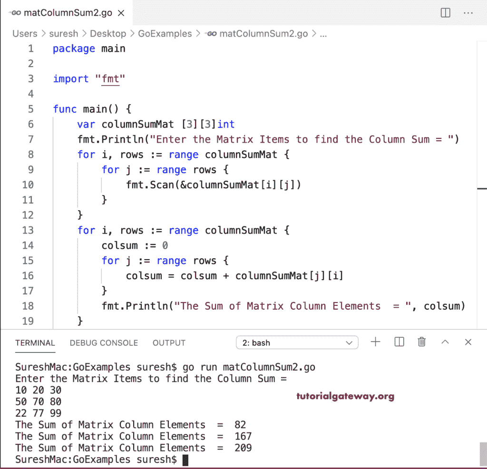

# Go 程序：以查找每个矩阵列的和

> 原文：<https://www.tutorialgateway.org/go-program-to-find-sum-of-each-matrix-column/>

编写一个 Go 程序，使用 for 循环计算每个矩阵列的和。它允许输入行、列和矩阵项。接下来，它找到给定矩阵中每一列的和。

```go
package main

import "fmt"

func main() {
    var i, j, rows, columns int

    var columnSumMat [10][10]int

    fmt.Print("Enter the Matrix rows and Columns = ")
    fmt.Scan(&rows, &columns)

    fmt.Println("Enter the Matrix Items to find the Columns Sum = ")
    for i = 0; i < rows; i++ {
        for j = 0; j < columns; j++ {
            fmt.Scan(&columnSumMat[i][j])
        }
    }

    for i = 0; i < rows; i++ {
        colsum := 0
        for j = 0; j < columns; j++ {
            colsum = colsum + columnSumMat[j][i]
        }
        fmt.Println("The Sum of Matrix Column Elements  = ", colsum)
    }
}
```

```go
Enter the Matrix rows and Columns = 2 2
Enter the Matrix Items to find the Columns Sum = 
10 20
30 70
The Sum of Matrix Column Elements  =  40
The Sum of Matrix Column Elements  =  90
```

使用 For 循环范围求矩阵中每列之和的 Golang 程序。

```go
package main

import "fmt"

func main() {

    var columnSumMat [3][3]int

    fmt.Println("Enter the Matrix Items to find the Column Sum = ")
    for i, rows := range columnSumMat {
        for j := range rows {
            fmt.Scan(&columnSumMat[i][j])
        }
    }
    for i, rows := range columnSumMat {
        colsum := 0
        for j := range rows {
            colsum = colsum + columnSumMat[j][i]
        }
        fmt.Println("The Sum of Matrix Column Elements  = ", colsum)
    }
}
```

