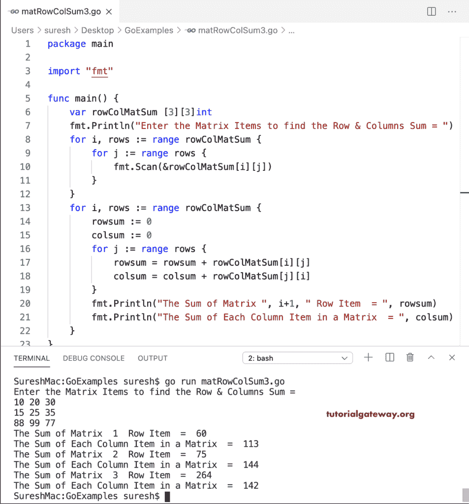

# Go 程序：查找矩阵每行和每列的总和

> 原文：<https://www.tutorialgateway.org/go-program-to-find-sum-of-each-row-and-column-of-a-matrix/>

写一个 Go 程序，求矩阵每行和每列的和。我们用一个 for 循环来求矩阵行的和，用另一个循环来求矩阵的和。

```go
package main

import "fmt"

func main() {
    var i, j, rows, columns int

    var rowColMatSum [10][10]int

    fmt.Print("Enter the Matrix rows and Columns = ")
    fmt.Scan(&rows, &columns)

    fmt.Println("Enter the Matrix Items to find the Row & Columns Sum = ")
    for i = 0; i < rows; i++ {
        for j = 0; j < columns; j++ {
            fmt.Scan(&rowColMatSum[i][j])
        }
    }
    for i = 0; i < rows; i++ {
        rowsum := 0
        for j = 0; j < columns; j++ {
            rowsum = rowsum + rowColMatSum[i][j]
        }
        fmt.Println("The Sum of Matrix ", i+1, " Row Item  = ", rowsum)
    }
    for i = 0; i < rows; i++ {
        colsum := 0
        for j = 0; j < columns; j++ {
            colsum = colsum + rowColMatSum[j][i]
        }
        fmt.Println("The Sum of Each Column Item in a Matrix  = ", colsum)
    }
}
```

```go
Enter the Matrix rows and Columns = 2 2
Enter the Matrix Items to find the Row & Columns Sum = 
10 20
90 120
The Sum of Matrix  1  Row Item  =  30
The Sum of Matrix  2  Row Item  =  210
The Sum of Each Column Item in a Matrix  =  100
The Sum of Each Column Item in a Matrix  =  140
```

Golang 程序，使用 For 循环范围查找矩阵中每行和每列的总和。

```go
package main

import "fmt"

func main() {

    var rowColMatSum [3][3]int

    fmt.Println("Enter the Matrix Items to find the Row & Columns Sum = ")
    for i, rows := range rowColMatSum {
        for j := range rows {
            fmt.Scan(&rowColMatSum[i][j])
        }
    }
    for i, rows := range rowColMatSum {
        rowsum := 0
        for j := range rows {
            rowsum = rowsum + rowColMatSum[i][j]
        }
        fmt.Println("The Sum of Matrix ", i+1, " Row Item  = ", rowsum)
    }
    for i, rows := range rowColMatSum {
        colsum := 0
        for j := range rows {
            colsum = colsum + rowColMatSum[j][i]
        }
        fmt.Println("The Sum of Each Column Item in a Matrix  = ", colsum)
    }
}
```

```go
Enter the Matrix Items to find the Row & Columns Sum = 
10 20 30
40 50 60
90 15 11
The Sum of Matrix  1  Row Item  =  60
The Sum of Matrix  2  Row Item  =  150
The Sum of Matrix  3  Row Item  =  116
The Sum of Each Column Item in a Matrix  =  140
The Sum of Each Column Item in a Matrix  =  85
The Sum of Each Column Item in a Matrix  =  101
```

在这个 Go 示例中，我们移除了额外的 for 循环，并将行和列的总和放在一个循环中，以计算矩阵行和列的总和。

```go
package main

import "fmt"

func main() {

    var rowColMatSum [3][3]int

    fmt.Println("Enter the Matrix Items to find the Row & Columns Sum = ")
    for i, rows := range rowColMatSum {
        for j := range rows {
            fmt.Scan(&rowColMatSum[i][j])
        }
    }
    for i, rows := range rowColMatSum {
        rowsum := 0
        colsum := 0
        for j := range rows {
            rowsum = rowsum + rowColMatSum[i][j]
            colsum = colsum + rowColMatSum[j][i]
        }
        fmt.Println("The Sum of Matrix ", i+1, " Row Item  = ", rowsum)
        fmt.Println("The Sum of Each Column Item in a Matrix  = ", colsum)
    }
}
```

