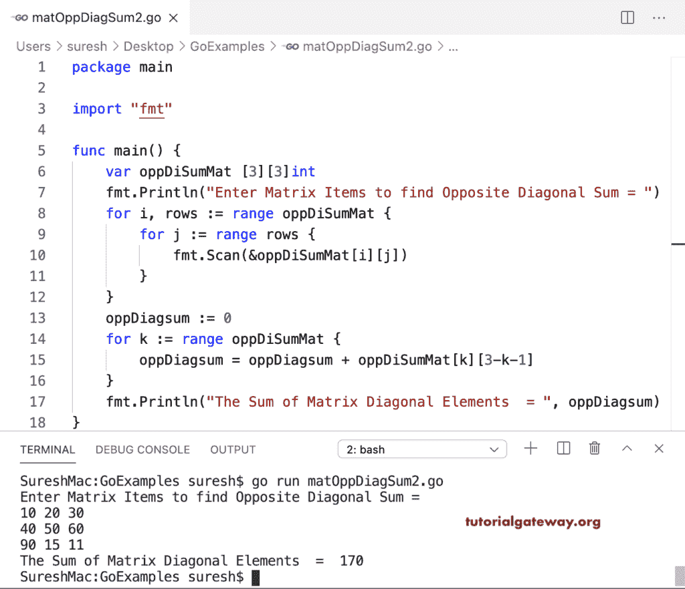

# Go 程序：求矩阵对角和

> 原文：<https://www.tutorialgateway.org/go-program-to-find-sum-of-matrix-opposite-diagonal/>

写一个 Go 程序，求矩阵中对角项的和。在这个 Go Matrix 反向对角线示例中，我们使用 for 循环来迭代矩阵行项目，并计算(oppDiagsum = oppDiagsum+oppDiSumMat[I][row-I-1])反向对角线项目的总和。

```go
package main

import "fmt"

func main() {
    var i, j, rows, columns int

    var oppDiSumMat [10][10]int

    fmt.Print("Enter the Matrix rows and Columns = ")
    fmt.Scan(&rows, &columns)

    fmt.Println("Enter Matrix Items to find Opposite Diagonal Sum = ")
    for i = 0; i < rows; i++ {
        for j = 0; j < columns; j++ {
            fmt.Scan(&oppDiSumMat[i][j])
        }
    }
    oppDiagsum := 0
    for i = 0; i < rows; i++ {
        oppDiagsum = oppDiagsum + oppDiSumMat[i][rows-i-1]
    }
    fmt.Println("The Sum of Matrix Diagonal Elements  = ", oppDiagsum)
}
```

```go
Enter the Matrix rows and Columns = 2 2
Enter Matrix Items to find Opposite Diagonal Sum = 
10 20
30 40
The Sum of Matrix Diagonal Elements  =  50
```

使用 For 循环范围求矩阵中对角元素之和的 Golang 程序。

```go
package main

import "fmt"

func main() {

    var oppDiSumMat [3][3]int

    fmt.Println("Enter Matrix Items to find Opposite Diagonal Sum = ")
    for i, rows := range oppDiSumMat {
        for j := range rows {
            fmt.Scan(&oppDiSumMat[i][j])
        }
    }
    oppDiagsum := 0
    for k := range oppDiSumMat {
        oppDiagsum = oppDiagsum + oppDiSumMat[k][3-k-1]
    }
    fmt.Println("The Sum of Matrix Diagonal Elements  = ", oppDiagsum)
}
```

