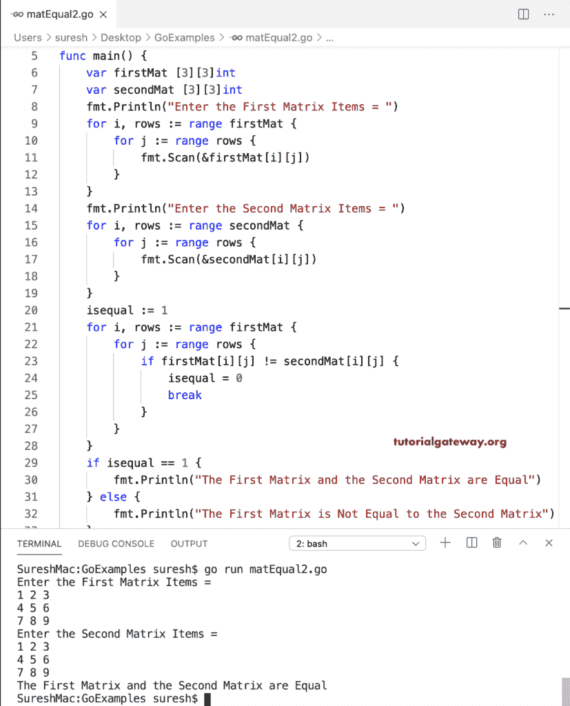

# Go 程序：检查两个矩阵是否相等

> 原文：<https://www.tutorialgateway.org/go-program-to-check-two-matrixes-are-equal/>

在 Go 编程中，我们可以使用等号运算符来检查两个矩阵是否相等。这个 Go 程序允许用户输入两个矩阵、大小和项目。接下来，我们使用 if else 语句(if firstMat == secondMat)来检查它们是否相等。

```go
package main

import "fmt"

func main() {
    var i, j, rows, columns int

    var firstMat [10][10]int
    var secondMat [10][10]int

    fmt.Print("Enter the Matrix rows and Columns = ")
    fmt.Scan(&rows, &columns)

    fmt.Println("Enter the First Matrix Items = ")
    for i = 0; i < rows; i++ {
        for j = 0; j < columns; j++ {
            fmt.Scan(&firstMat[i][j])
        }
    }
    fmt.Println("Enter the Second Matrix Items = ")
    for i = 0; i < rows; i++ {
        for j = 0; j < columns; j++ {
            fmt.Scan(&secondMat[i][j])
        }
    }
    if firstMat == secondMat {
        fmt.Println("The First Matrix and the Second Matrix are Equal")
    } else {
        fmt.Println("The First Matrix is Not Equal to the Second Matrix")
    }
}
```

```go
SureshMac:GoExamples suresh$ go run matEqual0.go
Enter the Matrix rows and Columns = 2 2
Enter the First Matrix Items = 
1 2 
3 4
Enter the Second Matrix Items = 
4 5
6 7
The First Matrix is Not Equal to the Second Matrix
SureshMac:GoExamples suresh$ go run matEqual0.go
Enter the Matrix rows and Columns = 2 2
Enter the First Matrix Items = 
1 2
3 4
Enter the Second Matrix Items = 
1 2
3 4
The First Matrix and the Second Matrix are Equal
```

## 检查两个矩阵相等的 Golang 程序。

在这个 Go 示例中，嵌套 for 循环迭代矩阵项。在循环中，if 语句(if firstMat[i][j]！= secondMat[i][j])检查第一个矩阵的每个项目是否不等于第二个矩阵。如果为真，则将零赋给 isequal 变量。最后，我们使用 if-else 来检查矩阵是否相等。

```go
package main

import "fmt"

func main() {
    var i, j, rows, columns int

    var firstMat [10][10]int
    var secondMat [10][10]int

    fmt.Print("Enter the Matrix rows and Columns = ")
    fmt.Scan(&rows, &columns)

    fmt.Println("Enter the First Matrix Items = ")
    for i = 0; i < rows; i++ {
        for j = 0; j < columns; j++ {
            fmt.Scan(&firstMat[i][j])
        }
    }
    fmt.Println("Enter the Second Matrix Items = ")
    for i = 0; i < rows; i++ {
        for j = 0; j < columns; j++ {
            fmt.Scan(&secondMat[i][j])
        }
    }
    isequal := 1
    for i = 0; i < rows; i++ {
        for j = 0; j < columns; j++ {
            if firstMat[i][j] != secondMat[i][j] {
                isequal = 0
                break
            }
        }
    }
    if isequal == 1 {
        fmt.Println("The First Matrix and the Second Matrix are Equal")
    } else {
        fmt.Println("The First Matrix is Not Equal to the Second Matrix")
    }
}
```

```go
Enter the Matrix rows and Columns = 2 3
Enter the First Matrix Items = 
1 2 3
4 5 6
Enter the Second Matrix Items = 
1 2 3
4 5 6
The First Matrix and the Second Matrix are Equal
```

转到程序，查找两个矩阵是否相等，是否用于循环范围。

```go
package main

import "fmt"

func main() {

    var firstMat [3][3]int
    var secondMat [3][3]int

    fmt.Println("Enter the First Matrix Items = ")
    for i, rows := range firstMat {
        for j := range rows {
            fmt.Scan(&firstMat[i][j])
        }
    }
    fmt.Println("Enter the Second Matrix Items = ")
    for i, rows := range secondMat {
        for j := range rows {
            fmt.Scan(&secondMat[i][j])
        }
    }
    isequal := 1
    for i, rows := range firstMat {
        for j := range rows {
            if firstMat[i][j] != secondMat[i][j] {
                isequal = 0
                break
            }
        }
    }
    if isequal == 1 {
        fmt.Println("The First Matrix and the Second Matrix are Equal")
    } else {
        fmt.Println("The First Matrix is Not Equal to the Second Matrix")
    }
}
```

