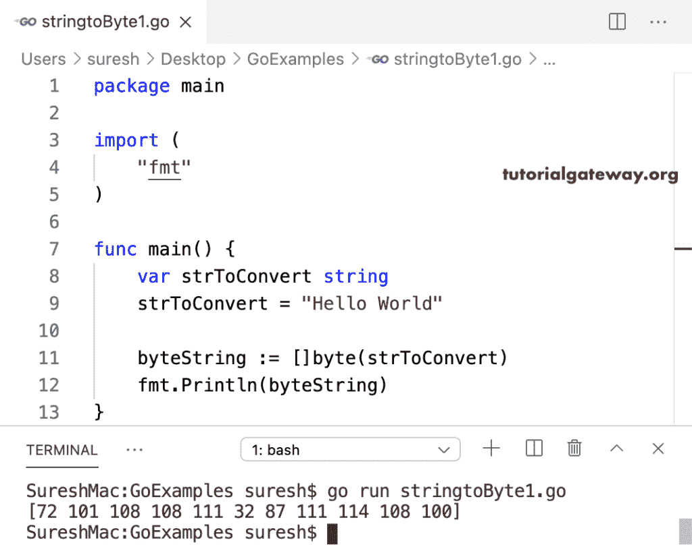

# Go 程序：字符串到字节数组

> 原文：<https://www.tutorialgateway.org/golang-string-to-byte-array/>

编写一个 Golang 程序，将给定的字符串转换成字节数组。在 Golang 中，byte 方法将字符串转换为字节数组。在本例中，[]byte(strToConvert)将字符串转换为字节数组。

```go
package main

import (
    "fmt"
)

func main() {
    var strToConvert string

    strToConvert = "Hello World"

    byteString := []byte(strToConvert)
    fmt.Println(byteString)
}
```



## 将字符串转换为字节数组的 Golang 程序示例 2

在 Go 编程中，复制函数将字符串复制到字节数组中。因此，我们声明了一个字节数组，并使用 copy 函数将字符串复制到字节数组。如果不知道字符串长度，用 len(strToConevrt)替换 16。

```go
package main

import (
	"fmt"
)

func main() {
	var strToConvert string

	strToConvert = "Tutorial Gateway"

	byteString := make([]byte, 16)

	copy(byteString, strToConvert)

	fmt.Println(byteString)

	byteString1 := make([]byte, 16)

	copy(byteString1[:], strToConvert)

	fmt.Println(byteString1)
}
```

```go
[84 117 116 111 114 105 97 108 32 71 97 116 101 119 97 121]
[84 117 116 111 114 105 97 108 32 71 97 116 101 119 97 121]
```