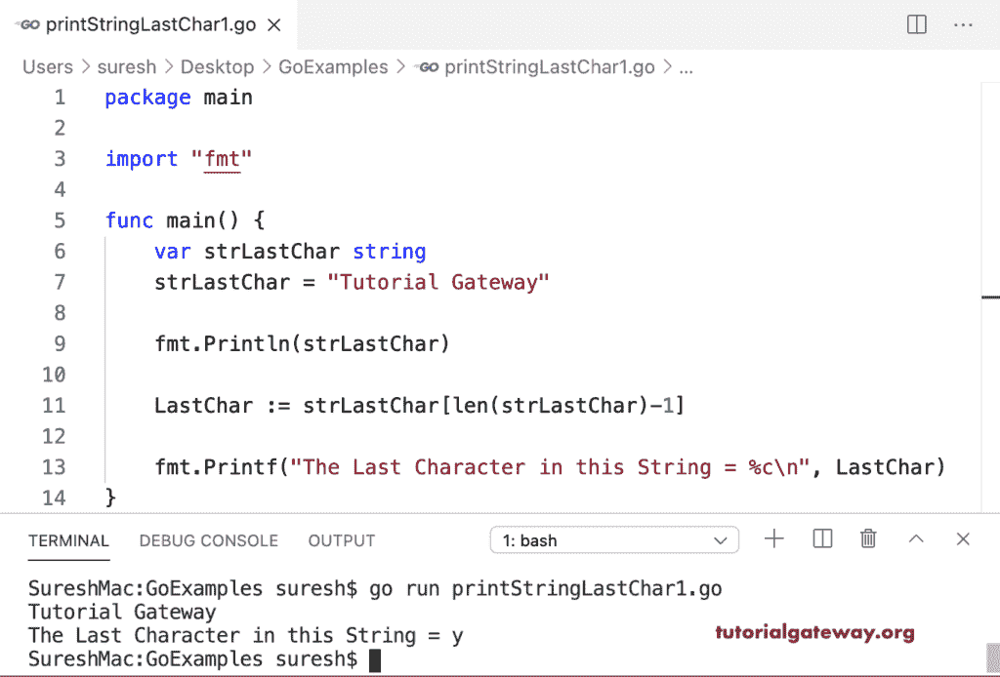

# Go 程序：打印字符串中的最后一个字符

> 原文：<https://www.tutorialgateway.org/go-program-to-print-last-character-in-a-string/>

编写一个 Go 程序来打印字符串中的最后一个字符。我们使用字符串索引位置来访问最后一个字符。这里，strlastcar[len(strlastcar)–1]返回给定字符串 strlastcar 中的最后一个字符。

```go
package main

import "fmt"

func main() {

    var strLastChar string

    strLastChar = "Tutorial Gateway"

    fmt.Println(strLastChar)

    LastChar := strLastChar[len(strLastChar)-1]

    fmt.Printf("The Last Character in this String = %c\n", LastChar)
}
```



上面的字符串代码返回字符串的最后一个字节作为输出。但是，通过对给定的 Golang 字符串进行切片，它会打印最后一个字符串字符。

```go
package main

import "fmt"

func main() {

    var strLastChar string

    strLastChar = "Golang Programs"

    fmt.Println(strLastChar)

    LastChar := strLastChar[len(strLastChar)-1:]

    fmt.Println("The Last Character in this String = ", LastChar)
}
```

```go
Golang Programs
The Last Character in this String =  s
```