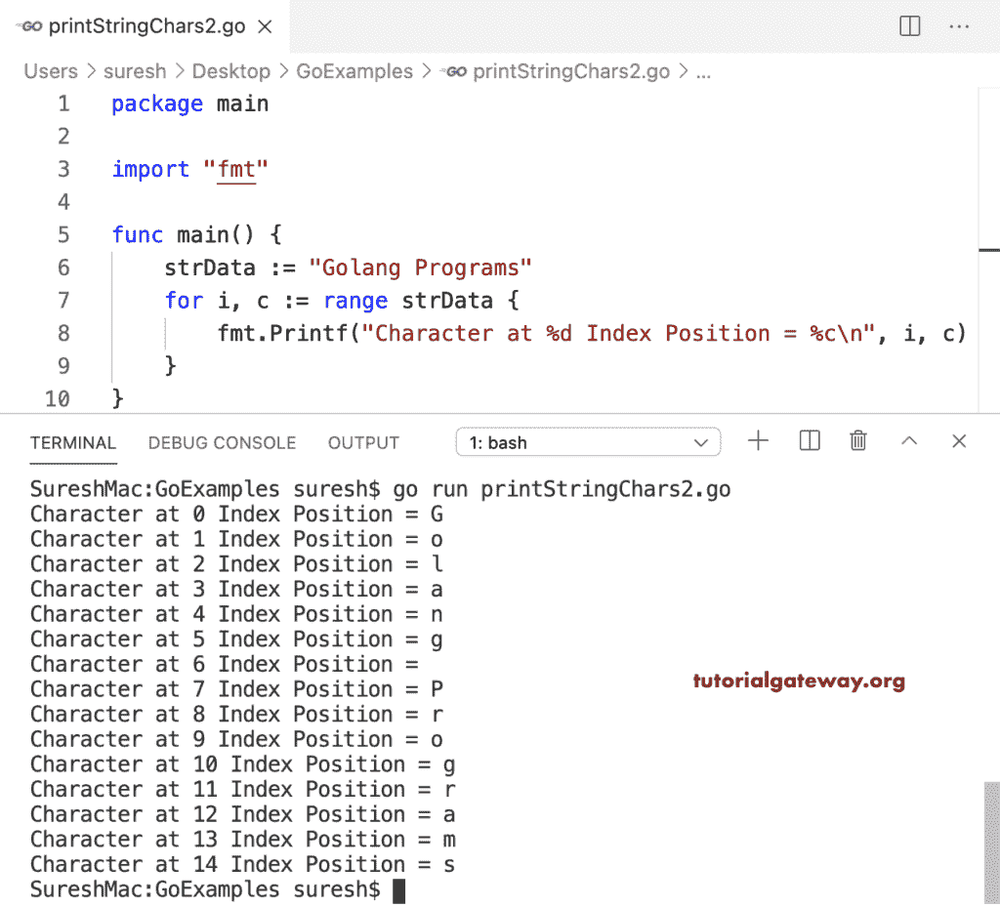

# Go 程序：打印字符串

> 原文：<https://www.tutorialgateway.org/go-program-to-print-string-characters/>

编写一个 Go 程序来打印给定字符串中的总字符数。在这个例子中，我们正在打印完整的字符串。

```go
package main

import "fmt"

func main() {

    var strData string

    strData = "Tutorial Gateway"

    fmt.Printf("%s", strData)
    fmt.Println(strData)
}
```

```go
Tutorial Gateway
Tutorial Gateway
```

## 使用 For 循环转到程序打印字符串

for 循环(对于 I:= 0；我< len(strData); i++) in this Golang program iterate string characters from start to end. The printf statement prints the index position and the original characters in a string.

```go
package main

import "fmt"

func main() {

    var strData string

    strData = "Tutorial Gateway"

    for i := 0; i < len(strData); i++ {
        fmt.Printf("Character at %d Index Position = %c\n", i, strData[i])
    }
}
```

```go
Character at 0 Index Position = T
Character at 1 Index Position = u
Character at 2 Index Position = t
Character at 3 Index Position = o
Character at 4 Index Position = r
Character at 5 Index Position = i
Character at 6 Index Position = a
Character at 7 Index Position = l
Character at 8 Index Position =  
Character at 9 Index Position = G
Character at 10 Index Position = a
Character at 11 Index Position = t
Character at 12 Index Position = e
Character at 13 Index Position = w
Character at 14 Index Position = a
Character at 15 Index Position = y
```

这个 Golang 程序使用 for 循环范围(对于 I，c := range strData)来打印字符串及其对应的索引位置。

```go
package main

import "fmt"

func main() {

    strData := "Golang Programs"

    for i, c := range strData {
        fmt.Printf("Character at %d Index Position = %c\n", i, c)
    }
}
```

