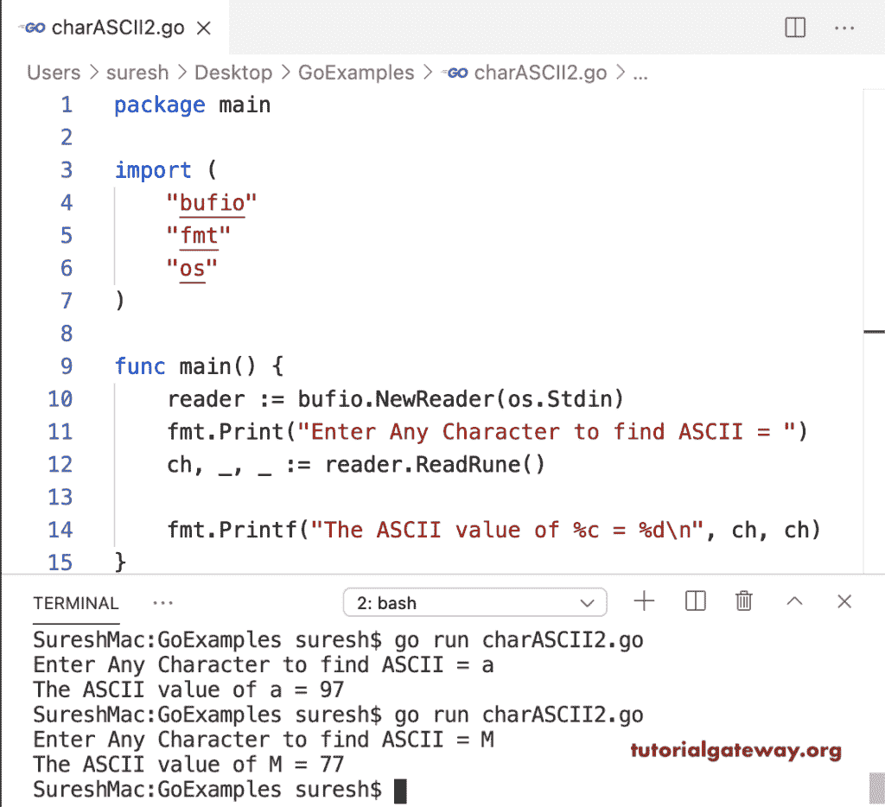

# Go 程序：查找字符的 ASCII 值

> 原文：<https://www.tutorialgateway.org/go-program-to-find-ascii-value-of-a-character/>

这个 Go 程序使用 printf 语句和字符串格式来查找并返回用户给定字符的 ASCII 值。

```go
package main

import (
    "bufio"
    "fmt"
    "os"
)

func main() {

    reader := bufio.NewReader(os.Stdin)

    fmt.Print("Enter Any Character to find ASCII = ")
    ch, _ := reader.ReadByte()

    fmt.Printf("The ASCII value of %c = %d\n", ch, ch)
}
```

```go
SureshMac:GoExamples suresh$ go run charASCII1.go
Enter Any Character to find ASCII = j
The ASCII value of j = 106
SureshMac:GoExamples suresh$ go run charASCII1.go
Enter Any Character to find ASCII = 0
The ASCII value of 0 = 48
SureshMac:GoExamples suresh$ go run charASCII1.go
Enter Any Character to find ASCII = o
The ASCII value of o = 111
```

这个 Go 程序允许用户输入符文并找到字符的 ASCII 值。

```go
package main

import (
    "bufio"
    "fmt"
    "os"
)

func main() {

    reader := bufio.NewReader(os.Stdin)

    fmt.Print("Enter Any Character to find ASCII = ")
    ch, _, _ := reader.ReadRune()

    fmt.Printf("The ASCII value of %c = %d\n", ch, ch)
}
```

