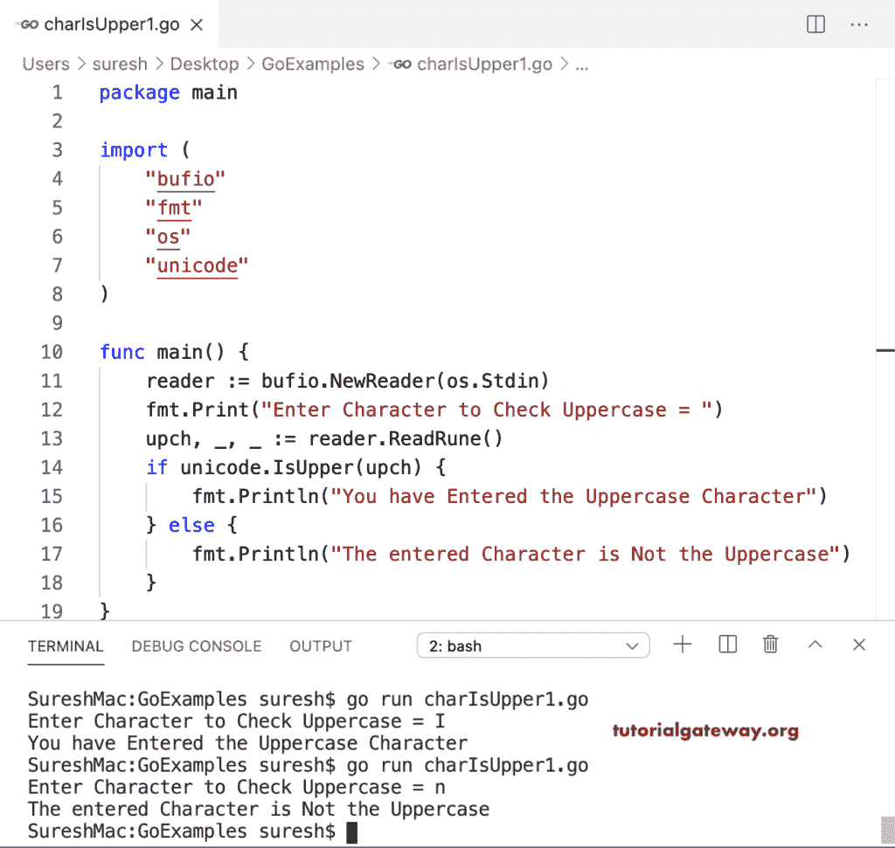

# Go 程序：检查字符是否大写

> 原文：<https://www.tutorialgateway.org/go-program-to-check-character-is-an-uppercase/>

编写一个 Go 程序，检查字符是否大写。unicode 映射器发现符文是大写字符。我们在 If else 条件(如果是 unicode)中使用了这个 IsUpper 函数。I upper(upch))查找给定字符是否大写。

```go
package main

import (
    "bufio"
    "fmt"
    "os"
    "unicode"
)

func main() {

    reader := bufio.NewReader(os.Stdin)

    fmt.Print("Enter Character to Check Uppercase = ")
    upch, _, _ := reader.ReadRune()

    if unicode.IsUpper(upch) {
        fmt.Println("You have Entered the Uppercase Character")
    } else {
        fmt.Println("The entered Character is Not the Uppercase")
    }
}
```



## Go 程序：检查字符是否大写

在这个大写字符的例子中，我们将给定的字节转换为符文(如果是 unicode。I upper(符文(upch)))，然后使用 I upper 函数。

```go
package main

import (
    "bufio"
    "fmt"
    "os"
    "unicode"
)

func main() {

    reader := bufio.NewReader(os.Stdin)

    fmt.Print("Enter Character to Check Uppercase = ")
    upch, _ := reader.ReadByte()

    if unicode.IsUpper(rune(upch)) {
        fmt.Println("You have Entered the Uppercase Character")
    } else {
        fmt.Println("The entered Character is Not the Uppercase")
    }
}
```

```go
SureshMac:GoExamples suresh$ go run charIsUpper2.go
Enter Character to Check Uppercase = o
The entered Character is Not the Uppercase
SureshMac:GoExamples suresh$ go run charIsUpper2.go
Enter Character to Check Uppercase = M
You have Entered the Uppercase Character
```

在这个 Golang 示例中，我们使用 If 条件(如果 upch >= 'A' && upch <= 'Z ')来检查字符是否在 A 和 Z 之间，如果为真，则它是大写字母。

```go
package main

import (
    "bufio"
    "fmt"
    "os"
)

func main() {

    reader := bufio.NewReader(os.Stdin)

    fmt.Print("Enter Character to Check Uppercase = ")
    upch, _ := reader.ReadByte()

    if upch >= 'A' && upch <= 'Z' {
        fmt.Println("You have Entered the Uppercase Character")
    } else {
        fmt.Println("The entered Character is Not the Uppercase")
    }
}
```

```go
SureshMac:GoExamples suresh$ go run charIsUpper3.go
Enter Character to Check Uppercase = A
You have Entered the Uppercase Character
SureshMac:GoExamples suresh$ go run charIsUpper3.go
Enter Character to Check Uppercase = k
The entered Character is Not the Uppercase
```

这个 Golang [程序](https://www.tutorialgateway.org/go-programs/)使用 ASCII 码(如果 upch>= 97&&upch<= 122)来查找字符是否大写。

```go
package main

import (
    "bufio"
    "fmt"
    "os"
)

func main() {

    reader := bufio.NewReader(os.Stdin)

    fmt.Print("Enter Character to Check Uppercase = ")
    upch, _ := reader.ReadByte()

    if upch >= 97 && upch <= 122 {
        fmt.Println("You have Entered the Lowercase Character")
    } else {
        fmt.Println("The entered Character is the Uppercase")
    }
}
```

```go
SureshMac:GoExamples suresh$ go run charIsUpper4.go
Enter Character to Check Uppercase = B
The entered Character is the Uppercase
SureshMac:GoExamples suresh$ go run charIsUpper4.go
Enter Character to Check Uppercase = z
You have Entered the Lowercase Character
```