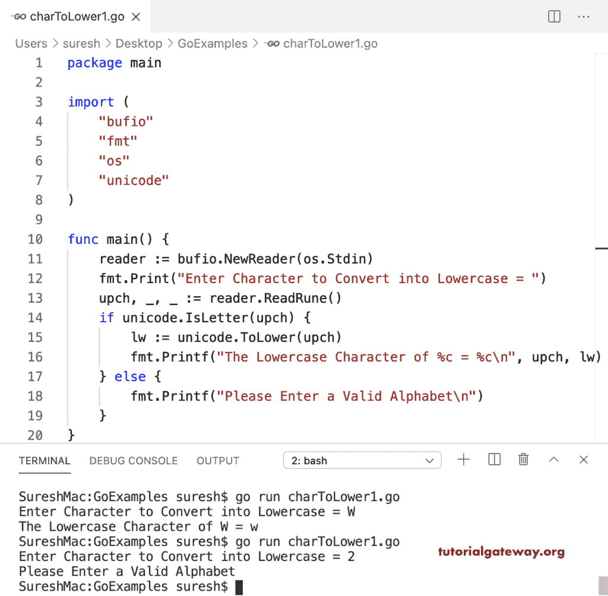

# Go 程序：将字符转换为小写

> 原文：<https://www.tutorialgateway.org/go-program-to-convert-character-to-lowercase/>

在这个 Go 程序中，为了将字符转换成小写，我们使用了一个字母来检查字符是否是字母表。接下来，我们使用了 unicode ToLower 函数(lw := unicode。ToLower(upch))将大写字符转换为小写字符。

```go
package main

import (
    "bufio"
    "fmt"
    "os"
    "unicode"
)

func main() {

    reader := bufio.NewReader(os.Stdin)

    fmt.Print("Enter Character to Convert into Lowercase = ")
    upch, _, _ := reader.ReadRune()

    if unicode.IsLetter(upch) {
        lw := unicode.ToLower(upch)
        fmt.Printf("The Lowercase Character of %c = %c\n", upch, lw)
    } else {
        fmt.Printf("Please Enter a Valid Alphabet\n")
    }
}
```



## Go 程序：将大写字符转换为小写字符

在这个 Go 大写到小写转换示例中，我们将给定的字节字符转换为 Rune (lw := unicode。ToLower(符文(upch)))然后使用 ToLower 函数。

```go
package main

import (
    "bufio"
    "fmt"
    "os"
    "unicode"
)

func main() {

    reader := bufio.NewReader(os.Stdin)

    fmt.Print("Enter Character to Convert into Lowercase = ")
    upch, _ := reader.ReadByte()

    if unicode.IsLetter(rune(upch)) {
        lw := unicode.ToLower(rune(upch))
        fmt.Printf("The Lowercase Character of %c = %c\n", upch, lw)
    } else {
        fmt.Printf("Please Enter a Valid Alphabet\n")
    }
}
```

```go
SureshMac:GoExamples suresh$ go run charToLower2.go
Enter Character to Convert into Lowercase = D
The Lowercase Character of D = d
SureshMac:GoExamples suresh$ go run charToLower2.go
Enter Character to Convert into Lowercase = 1
Please Enter a Valid Alphabet
```

该程序使用 ASCII 码(如果 upch >= 65 && upch <= 90)查找大写字符。如果为真，我们将 32 (lw := upch + 32)添加到 ASCII 值中，以将大写字符转换为小写字符。

```go
package main

import (
    "bufio"
    "fmt"
    "os"
)

func main() {

    reader := bufio.NewReader(os.Stdin)

    fmt.Print("Enter Character to Convert into Lowercase = ")
    upch, _ := reader.ReadByte()

    if upch >= 65 && upch <= 90 {
        lw := upch + 32
        fmt.Printf("The Lowercase Character of %c = %c\n", upch, lw)
    } else {
        fmt.Printf("Either You entered the Lowercase Char or Inalid Alphabet\n")
    }
}
```

```go
SureshMac:GoExamples suresh$ go run charToLower3.go
Enter Character to Convert into Lowercase = q
Either You entered the Lowercase Char or Inalid Alphabet
SureshMac:GoExamples suresh$ go run charToLower3.go
Enter Character to Convert into Lowercase = B
The Lowercase Character of B = b
```

在这个 Golang [示例](https://www.tutorialgateway.org/go-programs/)中，我们使用了 If 条件中的 A 和 Z(If upch>= ' A '&&upch<= ' Z ')来查找大写字符。如果为真，我们将向其 ASCII 值添加 32。

```go
package main

import (
    "bufio"
    "fmt"
    "os"
)

func main() {

    reader := bufio.NewReader(os.Stdin)

    fmt.Print("Enter Character to Convert into Lowercase = ")
    upch, _ := reader.ReadByte()

    if upch >= 'A' && upch <= 'Z' {
        lw := upch + 32
        fmt.Printf("The Lowercase Character of %c = %c\n", upch, lw)
    } else {
        fmt.Printf("Either You entered the Lowercase Char or Inalid Alphabet\n")
    }
}
```

```go
SureshMac:GoExamples suresh$ go run charToLower4.go
Enter Character to Convert into Lowercase = N
The Lowercase Character of N = n
SureshMac:GoExamples suresh$ go run charToLower4.go
Enter Character to Convert into Lowercase = j
Either You entered the Lowercase Char or Inalid Alphabet
```