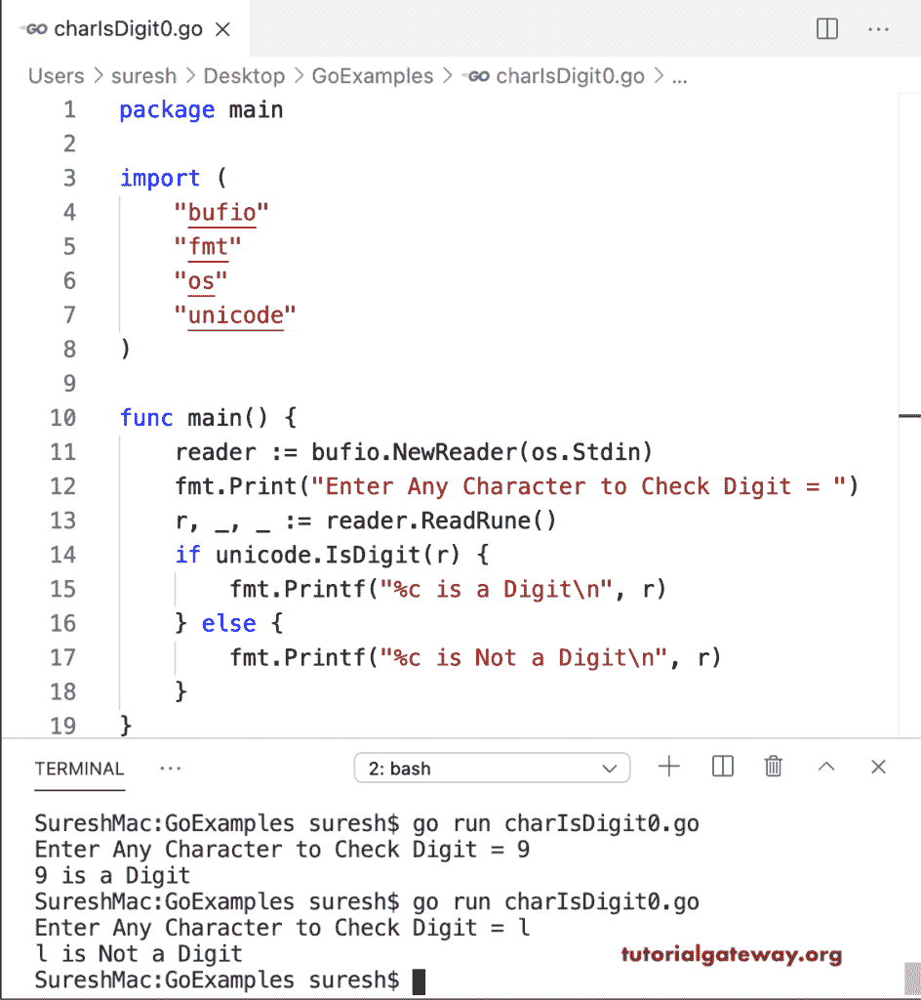

# Go 程序：查找字符是数字

> 原文：<https://www.tutorialgateway.org/go-program-to-find-character-is-a-digit/>

写一个 Go 程序，看看这个字符是不是数字。unicode 是数字检查符文是否是数字。我们使用了 If else 语句(如果是 unicode。IsDigit(r))与 unicode IsDigit 函数一起查找给定字符是否是数字。

```go
package main

import (
    "bufio"
    "fmt"
    "os"
    "unicode"
)

func main() {

    reader := bufio.NewReader(os.Stdin)

    fmt.Print("Enter Any Character to Check Digit = ")
    r, _, _ := reader.ReadRune()

    if unicode.IsDigit(r) {
        fmt.Printf("%c is a Digit\n", r)
    } else {
        fmt.Printf("%c is Not a Digit\n", r)
    }
}
```



unicode 包还有一个 IsNumber 函数(如果是 Unicode。IsNumber(r))检查字符是否为数字。这里，我们使用这个函数。

```go
package main

import (
    "bufio"
    "fmt"
    "os"
    "unicode"
)

func main() {

    reader := bufio.NewReader(os.Stdin)

    fmt.Print("Enter Any Character to Check Digit = ")
    r, _, _ := reader.ReadRune()

    if unicode.IsNumber(r) {
        fmt.Printf("%c is a Digit\n", r)
    } else {
        fmt.Printf("%c is Not a Digit\n", r)
    }
}
```

```go
SureshMac:GoExamples suresh$ go run charIsDigit1.go
Enter Any Character to Check Digit = 8
8 is a Digit
SureshMac:GoExamples suresh$ go run charIsDigit1.go
Enter Any Character to Check Digit = @
@ is Not a Digit
```

## Go 程序：查找字符是否为数字

在这个 Go 示例中，我们将给定的字节字符转换为 Rune(如果是 unicode。IsDigit(符文(ch))，然后使用 IsDigit 函数。

```go
package main

import (
    "bufio"
    "fmt"
    "os"
    "unicode"
)

func main() {

    reader := bufio.NewReader(os.Stdin)

    fmt.Print("Enter Any Character to Check Digit = ")
    ch, _ := reader.ReadByte()

    if unicode.IsDigit(rune(ch)) {
        fmt.Printf("%c is a Digit\n", ch)
    } else {
        fmt.Printf("%c is Not a Digit\n", ch)
    }
}
```

```go
SureshMac:GoExamples suresh$ go run charIsDigit2.go
Enter Any Character to Check Digit = 0
0 is a Digit
SureshMac:GoExamples suresh$ go run charIsDigit2.go
Enter Any Character to Check Digit = p
p is Not a Digit
```

0 到 9 之间的任何数字称为数字。我们使用 If 条件(if ch >= '0' && ch <= '9 ')来检查字符是否是数字。

```go
package main

import (
    "bufio"
    "fmt"
    "os"
)

func main() {

    reader := bufio.NewReader(os.Stdin)

    fmt.Print("Enter Any Character to Check Digit = ")
    ch, _ := reader.ReadByte()

    if ch >= '0' && ch <= '9' {
        fmt.Printf("%c is a Digit\n", ch)
    } else {
        fmt.Printf("%c is Not a Digit\n", ch)
    }
}
```

```go
SureshMac:GoExamples suresh$ go run charIsDigit3.go
Enter Any Character to Check Digit = 2
2 is a Digit
SureshMac:GoExamples suresh$ go run charIsDigit3.go
Enter Any Character to Check Digit = 8
8 is a Digit
```

本 Golang [程序](https://www.tutorialgateway.org/go-programs/)使用 ASCII 码(如果 ch > = 48 & & ch < = 57)检查字符是否为数字。

```go
package main

import (
    "bufio"
    "fmt"
    "os"
)

func main() {

    reader := bufio.NewReader(os.Stdin)

    fmt.Print("Enter Any Character to Check Digit = ")
    ch, _ := reader.ReadByte()

    if ch >= 48 && ch <= 57 {
        fmt.Printf("%c is a Digit\n", ch)
    } else {
        fmt.Printf("%c is Not a Digit\n", ch)
    }
}
```

```go
SureshMac:GoExamples suresh$ go run charIsDigit4.go
Enter Any Character to Check Digit = 5
5 is a Digit
SureshMac:GoExamples suresh$ go run charIsDigit4.go
Enter Any Character to Check Digit = n
n is Not a Digit
```