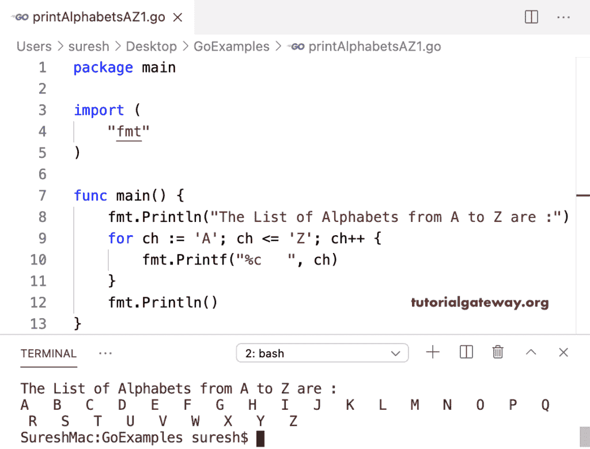

# Go 程序：返回字母从 A 到 Z

> 原文：<https://www.tutorialgateway.org/go-program-to-return-alphabets-from-a-to-z/>

在这个 Go 程序中，for 循环的迭代从 A 开始，到 Z 结束，以返回或显示大写字母 A 到 Z 之间的字母

```go
package main

import (
    "fmt"
)

func main() {
    fmt.Println("The List of Alphabets from A to Z are :")
    for ch := 'A'; ch <= 'Z'; ch++ {
        fmt.Printf("%c   ", ch)
    }
    fmt.Println()
}
```



在这个 Golang 程序中，我们使用 for 循环来迭代 ASCII 码(对于 ch:= 65；ch <= 90; ch++) and display the Alphabets from A to Z.

```go
package main

import (
    "fmt"
)

func main() {
    fmt.Println("The List of Alphabets from A to Z are :")
    for ch := 65; ch <= 90; ch++ {
        fmt.Printf("%c   ", ch)
    }
    fmt.Println()
}
```

```go
The List of Alphabets from A to Z are :
A   B   C   D   E   F   G   H   I   J   K   L   M   N   O   P   Q   R   S   T   U   V   W   X   Y   Z
```

本 Go [示例](https://www.tutorialgateway.org/go-programs/)允许输入起始大写字符(对于 ch:= stch；ch<= ' Z '；ch++)，并打印从该字母到 z 的字母

```go
package main

import (
    "bufio"
    "fmt"
    "os"
)

func main() {

    reader := bufio.NewReader(os.Stdin)

    fmt.Print("Enter the Starting  Character = ")
    stch, _ := reader.ReadByte()

    fmt.Printf("The List of Alphabets from %c to Z are :\n", stch)
    for ch := stch; ch <= 'Z'; ch++ {
        fmt.Printf("%c  ", ch)
    }
    fmt.Println()
}
```

```go
Enter the Starting  Character = K
The List of Alphabets from K to Z are :
K  L  M  N  O  P  Q  R  S  T  U  V  W  X  Y  Z 
```