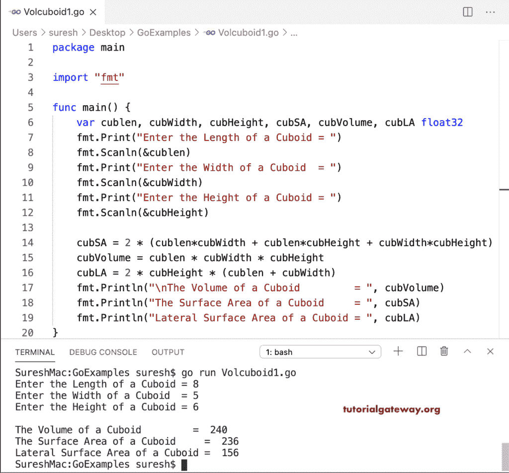

# Go 程序：找到长方体的体积和表面积

> 原文：<https://www.tutorialgateway.org/go-program-to-find-volume-and-surface-area-of-a-cuboid/>

写一个 Go 程序求长方体的体积和表面积。计算长方体体积、表面积和侧面表面积的数学公式是

*   长方体的总表面积= 2lw + 2lh + 2wh，其中 l =长，w =宽，h =高
*   长方体的体积=磅
*   长方体的侧面面积= 2h (l + w)

```go
package main

import "fmt"

func main() {

    var cublen, cubWidth, cubHeight, cubSA, cubVolume, cubLA float32

    fmt.Print("Enter the Length of a Cuboid = ")
    fmt.Scanln(&cublen)
    fmt.Print("Enter the Width of a Cuboid  = ")
    fmt.Scanln(&cubWidth)
    fmt.Print("Enter the Height of a Cuboid = ")
    fmt.Scanln(&cubHeight)

    cubSA = 2 * (cublen*cubWidth + cublen*cubHeight + cubWidth*cubHeight)
    cubVolume = cublen * cubWidth * cubHeight
    cubLA = 2 * cubHeight * (cublen + cubWidth)

    fmt.Println("\nThe Volume of a Cuboid         = ", cubVolume)
    fmt.Println("The Surface Area of a Cuboid     = ", cubSA)
    fmt.Println("Lateral Surface Area of a Cuboid = ", cubLA)
}
```

