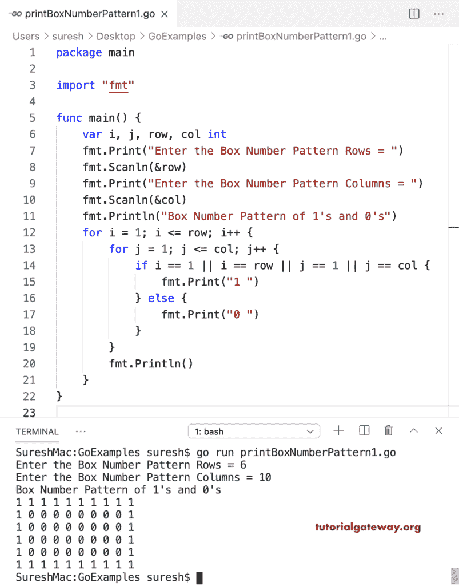

# Go 程序：打印 1 和 0 的箱号模式

> 原文：<https://www.tutorialgateway.org/go-program-to-print-box-number-pattern-of-1-and-0/>

编写一个 Go 程序来打印 1 和 0 的箱号模式。在这个 Golang Box 模式示例中，嵌套 for 循环迭代行和列。if 语句(if i == 1 || i == row || j == 1 || j == col)检查它是第一行还是第一列，是最后一行还是最后一列。如果为真，则打印 1；否则，打印 0。

```go
package main

import "fmt"

func main() {

    var i, j, row, col int

    fmt.Print("Enter the Box Number Pattern Rows = ")
    fmt.Scanln(&row)

    fmt.Print("Enter the Box Number Pattern Columns = ")
    fmt.Scanln(&col)

    fmt.Println("Box Number Pattern of 1's and 0's")
    for i = 1; i <= row; i++ {
        for j = 1; j <= col; j++ {
            if i == 1 || i == row || j == 1 || j == col {
                fmt.Print("1 ")
            } else {
                fmt.Print("0 ")
            }
        }
        fmt.Println()
    }
}
```



## Golang 程序打印 0 和 1 的箱号模式

在这个 1 和 0 的箱号模式的例子中，我们互换了 0 和 1。

```go
package main

import "fmt"

func main() {

    var i, j, row, col int

    fmt.Print("Enter the Box Number Pattern Rows = ")
    fmt.Scanln(&row)

    fmt.Print("Enter the Box Number Pattern Columns = ")
    fmt.Scanln(&col)

    fmt.Println("Box Number Pattern of 1's and 0's")
    for i = 1; i <= row; i++ {
        for j = 1; j <= col; j++ {
            if i == 1 || i == row || j == 1 || j == col {
                fmt.Print("0 ")
            } else {
                fmt.Print("1 ")
            }
        }
        fmt.Println()
    }
}
```

```go
Enter the Box Number Pattern Rows = 7
Enter the Box Number Pattern Columns = 12
Box Number Pattern of 1's and 0's
0 0 0 0 0 0 0 0 0 0 0 0 
0 1 1 1 1 1 1 1 1 1 1 0 
0 1 1 1 1 1 1 1 1 1 1 0 
0 1 1 1 1 1 1 1 1 1 1 0 
0 1 1 1 1 1 1 1 1 1 1 0 
0 1 1 1 1 1 1 1 1 1 1 0 
0 0 0 0 0 0 0 0 0 0 0 0 
```

这个 Golang 程序允许在框外和框内输入值。接下来，它打印 x 作为盒子外面的数字，y 是盒子里面的数字。

```go
package main

import "fmt"

func main() {

    var i, j, row, col, x, y int

    fmt.Print("Enter the Box Number Pattern Rows and Columns = ")
    fmt.Scan(&row, &col)

    fmt.Print("Enter the Outside and Inside Values = ")
    fmt.Scanln(&x, &y)

    fmt.Println("Box Number Pattern of 1's and 0's")
    for i = 1; i <= row; i++ {
        for j = 1; j <= col; j++ {
            if i == 1 || i == row || j == 1 || j == col {
                fmt.Printf("%d ", x)
            } else {
                fmt.Printf("%d ", y)
            }
        }
        fmt.Println()
    }
}
```

```go
Enter the Box Number Pattern Rows and Columns = 6 20
Enter the Outside and Inside Values = 9 4
Box Number Pattern of 1's and 0's
9 9 9 9 9 9 9 9 9 9 9 9 9 9 9 9 9 9 9 9 
9 4 4 4 4 4 4 4 4 4 4 4 4 4 4 4 4 4 4 9 
9 4 4 4 4 4 4 4 4 4 4 4 4 4 4 4 4 4 4 9 
9 4 4 4 4 4 4 4 4 4 4 4 4 4 4 4 4 4 4 9 
9 4 4 4 4 4 4 4 4 4 4 4 4 4 4 4 4 4 4 9 
9 9 9 9 9 9 9 9 9 9 9 9 9 9 9 9 9 9 9 9 
```