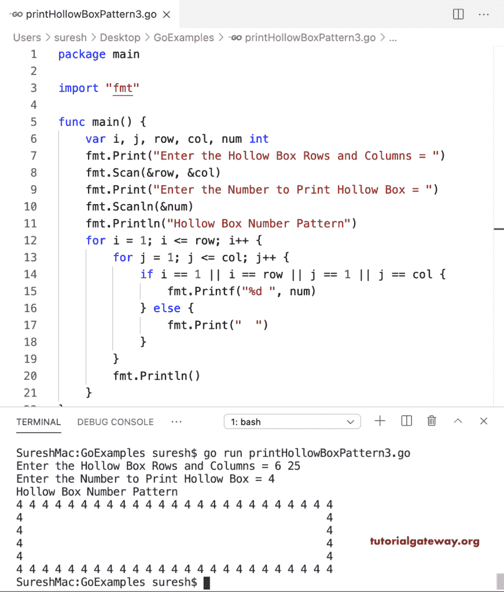

# Go 程序：打印数字的空心盒图案

> 原文：<https://www.tutorialgateway.org/go-program-to-print-hollow-box-number-pattern/>

编写一个 Go 程序来打印 1 的空心盒号模式。在这个 Golang 空心盒号模式示例中，嵌套 for 循环迭代行和列。if 语句(if i == 1 || i == row || j == 1 || j == col)检查它是第一行还是第一列，是最后一行还是最后一列。如果为真，则打印 1；否则，它会打印空白空间。

```go
package main

import "fmt"

func main() {

    var i, j, row, col int

    fmt.Print("Enter the Hollow Box Rows and Columns = ")
    fmt.Scan(&row, &col)

    fmt.Println("Hollow Box Number Pattern")
    for i = 1; i <= row; i++ {
        for j = 1; j <= col; j++ {
            if i == 1 || i == row || j == 1 || j == col {
                fmt.Print("1 ")
            } else {
                fmt.Print("  ")
            }
        }
        fmt.Println()
    }
}
```

```go
Enter the Hollow Box Rows and Columns = 7 22
Hollow Box Number Pattern
1 1 1 1 1 1 1 1 1 1 1 1 1 1 1 1 1 1 1 1 1 1 
1                                         1
1                                         1 
1                                         1 
1                                         1 
1                                         1 
1 1 1 1 1 1 1 1 1 1 1 1 1 1 1 1 1 1 1 1 1 1 
```

## Golang 程序打印数字的 0 的空心盒图案

在这个空心盒数字图案的例子中，我们用 1 代替了 0。

```go
package main

import "fmt"

func main() {

    var i, j, row, col int

    fmt.Print("Enter the Hollow Box of 0's Rows and Columns = ")
    fmt.Scan(&row, &col)

    fmt.Println("Hollow Box Number Pattern of 0's")
    for i = 1; i <= row; i++ {
        for j = 1; j <= col; j++ {
            if i == 1 || i == row || j == 1 || j == col {
                fmt.Print("0 ")
            } else {
                fmt.Print("  ")
            }
        }
        fmt.Println()
    }
}
```

```go
Enter the Hollow Box of 0's Rows and Columns = 8 20
Hollow Box Number Pattern of 0's
0 0 0 0 0 0 0 0 0 0 0 0 0 0 0 0 0 0 0 0 
0                                     0 
0                                     0 
0                                     0 
0                                     0 
0                                     0 
0                                     0 
0 0 0 0 0 0 0 0 0 0 0 0 0 0 0 0 0 0 0 0 
```

这个 Golang 示例允许输入数字，并以空心方框模式打印该数字。

```go
package main

import "fmt"

func main() {

    var i, j, row, col, num int

    fmt.Print("Enter the Hollow Box Rows and Columns = ")
    fmt.Scan(&row, &col)

    fmt.Print("Enter the Number to Print Hollow Box = ")
    fmt.Scanln(&num)

    fmt.Println("Hollow Box Number Pattern")
    for i = 1; i <= row; i++ {
        for j = 1; j <= col; j++ {
            if i == 1 || i == row || j == 1 || j == col {
                fmt.Printf("%d ", num)
            } else {
                fmt.Print("  ")
            }
        }
        fmt.Println()
    }
}
```

