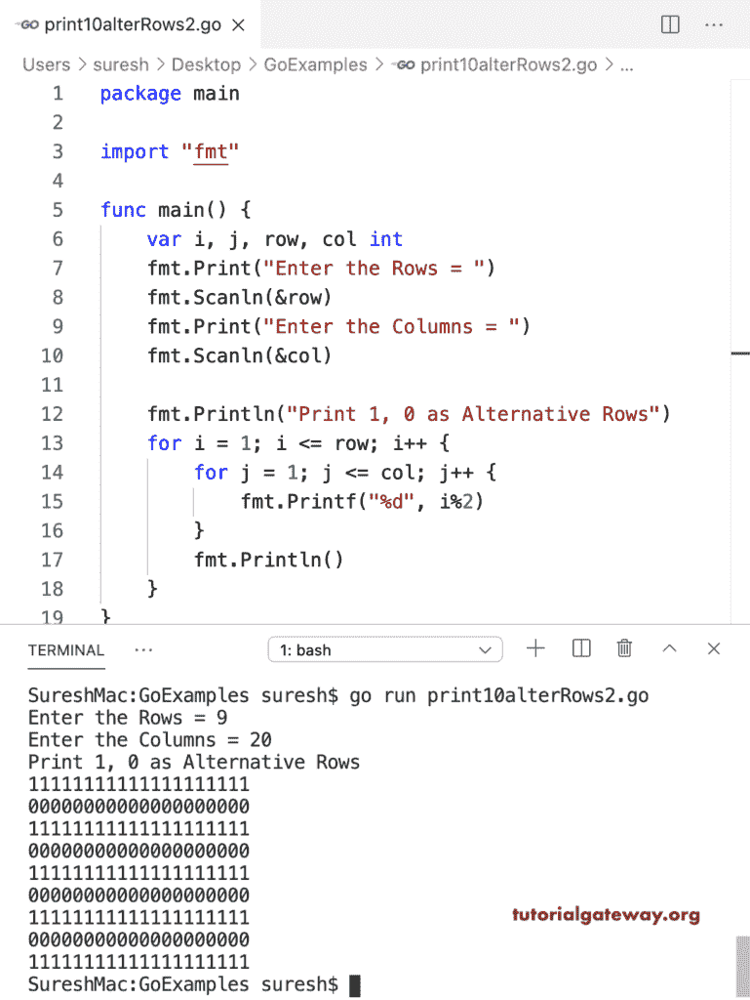

# Go 程序：在备选行中打印 1 和 0

> 原文：<https://www.tutorialgateway.org/go-program-to-print-1-and-0-in-alternative-rows/>

编写一个 Go 程序，在可选行中打印 1 和 0。在这个 Golang 示例中，嵌套 for 循环迭代用户输入的行和列。在循环中，if 语句(if i%2！= 0)检查第二行百分比是否不等于零。如果为真，则打印该行中的 1；否则，打印 0 作为行值。

```go
package main

import "fmt"

func main() {

    var i, j, row, col int

    fmt.Print("Enter the Rows = ")
    fmt.Scanln(&row)

    fmt.Print("Enter the Columns = ")
    fmt.Scanln(&col)

    fmt.Println("Print 1, 0 as Alternative Rows")
    for i = 1; i <= row; i++ {
        for j = 1; j <= col; j++ {
            if i%2 != 0 {
                fmt.Print("1")
            } else {
                fmt.Print("0")
            }
        }
        fmt.Println()
    }
}
```

```go
Enter the Rows = 5
Enter the Columns = 10
Print 1, 0 as Alternative Rows
1111111111
0000000000
1111111111
0000000000
1111111111
```

在这个 Golang 程序中，我们删除了额外的 if 语句来打印可选行中的 1 和 0。

```go
package main

import "fmt"

func main() {

    var i, j, row, col int

    fmt.Print("Enter the Rows = ")
    fmt.Scanln(&row)

    fmt.Print("Enter the Columns = ")
    fmt.Scanln(&col)

    fmt.Println("Print 1, 0 as Alternative Rows")
    for i = 1; i <= row; i++ {
        for j = 1; j <= col; j++ {
            fmt.Printf("%d", i%2)
        }
        fmt.Println()
    }
}
```



## Go 程序：在可选行中打印 0 和 1

我们在 If else 语句中交换了 0 和 1 行的值。

```go
package main

import "fmt"

func main() {

    var i, j, row, col int

    fmt.Print("Enter the Rows = ")
    fmt.Scanln(&row)

    fmt.Print("Enter the Columns = ")
    fmt.Scanln(&col)

    fmt.Println("Print 0, 1 as Alternative Rows")
    for i = 1; i <= row; i++ {
        for j = 1; j <= col; j++ {
            if i%2 != 0 {
                fmt.Print("0")
            } else {
                fmt.Print("1")
            }
        }
        fmt.Println()
    }
}
```

```go
Enter the Rows = 9
Enter the Columns = 30
Print 0, 1 as Alternative Rows
000000000000000000000000000000
111111111111111111111111111111
000000000000000000000000000000
111111111111111111111111111111
000000000000000000000000000000
111111111111111111111111111111
000000000000000000000000000000
111111111111111111111111111111
000000000000000000000000000000
```